# 강남드림 — 현재 상태

> **자동 생성 문서다. 손으로 고치지 않는다** — 다음 생성에서 지워진다.
> 값을 바꾸려면 이 파일이 아니라 원본(큐 표·정본 JSON·콘텐츠)을 고친다.
>
> 재생성: `python3 tools/project_dashboard.py --md docs/STATUS.md`
> 전 구간 선택 그래프를 대화형으로 보려면:
> `python3 tools/project_dashboard.py` → `build/project_dashboard.html`
>
> 생성 시각 · 커밋: `2026-08-03 07:37 UTC · cc152b57`

**개발용이다.** 아래는 `tint`·`route_*`와 정확한 수치를 그대로 적는다.
플레이어에게 노출하지 않는 값이므로 이 문서를 플레이어 대상 자료로 쓰지 않는다.

## 사람만 할 수 있는 판정

**초록불은 계약을 지켰다는 뜻이지 좋다는 뜻이 아니다.** 아래는 자동 검사가
대신할 수 없어 남아 있는 것이며, 원장은
[`human_gates.json`](human_gates.json)이 소유한다.

| 범위 | 판정 | 후보 | 표본·환경 | 합격 기준 | 소유 |
|---|---|---|---|---|---|
| claim:controller · 공개 데모의 Steam Deck·DualSense·Switch Pro 지원 주장 | **물리 Steam Deck·DualSense·Switch Pro 실기기**<br><sub>InputMatrixCheck는 매핑과 글리프를 본다. 손에 쥐었을 때의 오작동은 실기기에서만 나온다.</sub> | `demo_rc · REBUILD 대기` | demo_physical_controller_matrix<br>Steam Deck·DualSense·Switch Pro를 각각 실제 장치에서 확인<br>배포 대상 플랫폼 패키지와 동일한 demo_rc 사용 | 각 장치에서 잘못 누름·포커스 소실·입력 지연 없이 데모 진행<br>Steam Deck에서 장면 전환 프레임 드롭과 셰이더 컴파일 끊김이 체험을 훼손하지 않음 | `USER-P0N` |
| claim:ja · 일본어 본문·엔딩·카탈로그를 출시 언어로 표시하는 주장 | **일본어 원어민 검수**<br><sub>커버리지 검사는 키 누락과 한글 누출을 잡는다. 자연스러움은 원어민만 안다.</sub> | `full_rc · REBUILD 대기` | ja_native_release_review<br>일본어 본문·엔딩·카탈로그와 대표 15장 캡처<br>게임 문맥을 아는 일본어 원어민 검수자 | 의미 반전·누락·한글 누출·번역투가 출시 표면에 없음<br>원어민이 자연스러운 일본어 출시본으로 GO | `ORDER-21` |
| demo · Core Loop V2의 1~24주 전체와 주 25 진입 전 기록 CTA | **데모 24주 전환·사람 GO**<br><sub>자동 게이트는 도달성과 계약을 본다. 24주가 하나의 이야기로 읽히는지는 사람 판정이 남는다.</sub> | `demo_rc · REBUILD 대기` | demo_user_normal_reading<br>demo_rc를 새 세이브로 시작해 24주와 CTA까지 정상 독해<br>중간 저장·복귀를 포함해 장면과 월간 전환을 기록 | 1~24주가 끊긴 기능 묶음이 아니라 하나의 이야기로 읽힘<br>24주 회고와 CTA가 갑작스러운 차단이 아니라 다음을 궁금하게 만드는 종결로 작동<br>사용자 최종 GO | `ORDER-57` |
| demo · Core Loop V2의 월간 네 약속·생계/성장/회복 루틴·다음 달 영수증 | **주간 루프가 재미있는가 — 망설임과 전략**<br><sub>루프 검사는 선택지 수와 도달성을 본다. 망설였는지는 사람만 안다.</sub> | `demo_rc · REBUILD 대기` | demo_user_normal_reading<br>demo_rc 24주 정상 독해 플레이<br>망설인 장면·선택 원문과 다르게 플레이할 의향을 기록 | 같은 달에 함께 잡을 수 없는 약속과 루틴 사이에서 실제 고민이 생김<br>다르게 플레이하면 다른 5년이 될 것 같다는 사람 GO | `ORDER-26` |
| demo · KO/EN 데모 1~24주를 정상 독해 속도로 진행하는 체험 | **정상 속도 데모 24주 플레이**<br><sub>페이싱 검사는 사건 수와 간격을 센다. 지루한지는 세어지지 않는다.</sub> | `demo_rc · REBUILD 대기` | demo_normal_reading_full_run<br>같은 demo_rc에서 KO와 EN 각 1회<br>처음부터 24주 CTA까지 정상 독해 속도로 진행 | 반복 입력과 장면 간격을 포함한 24주 몰입에 사람 GO<br>자동 완주나 추정 플레이타임을 사람 판정으로 대신하지 않음 | `ORDER-22` |
| demo · KO/EN 데모 1~24주의 장면·폰·월간 계획·첫 청구서 연속 A/V | **데모 24주 연속 A/V 청취**<br><sub>계약 검사는 큐 존재와 파일 재생을 본다. 24주 동안 침묵·반복·음량 피로가 장면 흐름을 깨는지는 연속해서 들어야 안다.</sub> | `demo_rc · REBUILD 대기` | demo_av_human_review<br>같은 demo_rc의 KO/EN 24주 경로를 헤드폰·노트북 스피커·거실 TV에서 연속 청취<br>저장·복귀와 장면/폰/결산 전환을 포함 | 대사 가독성·장소 식별·음악 피로·효과음 반복에 사람 GO<br>무음·잘린 큐·장면 밖 잔류·갑작스러운 음량 변화가 24주 흐름을 깨지 않음 | `ORDER-57` |
| demo · 데모 시작 흐름·장면·폰·선택·결산·CTA의 표면 물성 | **화면이 싸구려 웹 모달이 아니라 이 게임의 물건으로 보이는가**<br><sub>surface_coherence는 분열의 흔적을 센다. 세지 못하는 것은 통일된 화면이 좋은가다.</sub> | `demo_rc · REBUILD 대기` | demo_surface_human_review<br>KO/EN demo_rc를 720p·800p·1080p에서 검토<br>마우스·패드 양쪽으로 실제 선택과 폰 표면을 조작 | 화면이 범용 웹 버튼 묶음이 아니라 강남드림의 같은 물건으로 보임<br>표면 전환 뒤 폰트·테마·포커스·재질이 다른 제품처럼 갈라지지 않음 | `ORDER-63` |
| demo · 데모 주연의 같은 감정군 표정·자세·시선 연기 | **표정 문법 — 같은 감정을 인물마다 다르게 연기하는가**<br><sub>자산 검사는 파일 유무를 본다. 연기의 차이는 나란히 놓고 봐야 안다.</sub> | `demo_rc · REBUILD 대기` | demo_cast_identity_review<br>같은 감정군의 주연 표정·자세·시선을 나란히 검토<br>실제 demo_rc 장면 크기에서 확인 | 같은 감정도 인물마다 고유한 표정·자세·시선 문법으로 읽힘 | `ORDER-64` |
| demo · 데모에 노출되는 주연 6인의 64 px 실루엣 | **64 px 실루엣 — 인물이 64픽셀에서 구분되는가**<br><sub>서명표는 소품과 모티프의 존재를 센다. 알아보는지는 눈으로 봐야 한다.</sub> | `demo_rc · REBUILD 대기` | demo_cast_identity_review<br>같은 크기·무채색 조건으로 주연 6인을 나란히 검토<br>실제 demo_rc 화면과 원본 자산을 함께 확인 | 이름·색·배경 없이도 여섯 인물을 서로 구분할 수 있음 | `ORDER-64` |
| demo · 데모에 노출되는 주연의 대표 장면과 고유 소품·욕망·모순 | **장면 소유 — 다른 인물로 대체 불가능한 장면을 갖는가**<br><sub>기계는 인물이 등장하는 장면 수를 센다. 대체 가능한지는 읽어야 안다.</sub> | `demo_rc · REBUILD 대기` | demo_cast_identity_review<br>주연별 대표 데모 장면을 이름을 가리고 교차 독해<br>대사·행동·소품을 다른 주연으로 바꿀 수 있는지 기록 | 각 주연이 다른 인물로 대체하면 무너지는 대표 장면을 하나 이상 가짐 | `ORDER-64` |
| demo · 무설명 30분 외부 정상 독해 — 24주 완주·위시리스트 판정과는 별도 | **외부 정상 독해 10인 플레이 (현재 0/10)**<br><sub>정합 검사는 모순을 잡지 재미를 잡지 않는다. 처음 읽는 사람만 아는 것이 있다.</sub> | `demo_rc · REBUILD 대기` | demo_external_readthrough_10<br>같은 revision과 manifest의 10명<br>EN 3명 이상<br>서사 게임 경험자·비경험자 각 4명 이상<br>개인정보 없는 무설명 30분 세션 | P0 기술 오류 세션 0<br>구체적인 다음 3주 계획 2점이 10명 중 7명 이상<br>playtest_report가 READY_FOR_HUMAN_VERDICT이고 원문을 사람이 검토해 GO | `ORDER-28` |
| demo · 프롤로그 정체성 선택과 24주 동안 반복된 민준의 동기 | **동기 문장을 플레이어가 실제로 기억하는가**<br><sub>각인 검사는 문장이 노출됐는지만 안다. 기억은 사람에게 물어야 한다.</sub> | `demo_rc · REBUILD 대기` | demo_user_normal_reading<br>demo_rc 24주 정상 독해 직후 유도 없이 질문<br>민준의 다음 일이 궁금한지와 플레이어가 고른 수첩 문장을 함께 기록 | 플레이어가 자신이 고른 수첩 문장을 기억함<br>민준에게 다음에 무슨 일이 생길지 궁금하다는 사람 판정 | `ORDER-23` |
| full · 1~5장 대표 정점·연결·Quiet/Echo/Decision·활동·엔딩의 연속 A/V | **장별 헤드폰·노트북·TV 연속 청취**<br><sub>자동 검사는 파일 존재와 계약만 본다. 반복이 지겨운지, 따로 찾아들을 만한지는 들어야 안다.</sub> | `full_rc · REBUILD 대기` | full_av_human_review<br>각 장 대표 경로를 헤드폰·노트북 스피커·거실 TV에서 청취<br>USER-P0N 최종 A/V 판정과 같은 full_rc 사용 | 대사 가독성·장소 식별·음악 피로·효과음 반복·Moral 사람층 변화가 모두 GO<br>같은 장소 재시작과 장면 밖 잔류가 사람 청취에서 거슬리지 않음 | `ORDER-43` |

## 당신의 결정을 기다리는 것

에이전트가 작업 중 부딪혀 올린 제안이다. 규칙·상한은
[`PROPOSALS.md`](PROPOSALS.md)가 소유하며, 21일이 지나면 감사가 실패한다.

| | 제안 | 안 하면 계속 내는 것 | 권고 | 열림 |
|---|---|---|---|---|
| `P-4` | 데모 완료 저장을 정식판 25주로 넘기는 명시적 브리지를 둔다 | build flavor를 저장·로드 경계에서 판독하고 완료 CTA, 월초 경제, | **한다. 밸런스 오더에 섞지 말고 `ORDER-70` 직후, retail 기본** | 2026-08-03 |
| `P-5` | 즉시 사망 가능한 선택에는 선택 전 확정 비용을 보여 준다 | StoryMode 선택 레이아웃과 KO/EN·패드·720p 회귀가 필요하다. | **한다. 전 선택의 스프레드시트화가 아니라 치명적 즉시 비용에만** | 2026-08-03 |
| `P-6` | 기회 투자와 현금 원장을 실제 원 단위로 정산한다 | 240주 경제 원장과 기존 정확 수치 회귀를 다시 돌리고, 소수 현금을 | **한다. 화폐 단위 불변식이므로 정식판 이월·retail 전환 전에** | 2026-08-03 |
| `P-7` | V2 초반에 125년 계산의 동기만 다시 심고 옛 3택은 재편한다 | 첫 5분 호흡, KO/EN 산문, 수첩·계획 영수증, legacy callback 3종과 | **한다. 7개월차 재생은 계속 막고, 플레이테스트 flavor 뒤** | 2026-08-03 |

## 한눈에

| 지표 | 값 | 뜻 |
|---|---:|---|
| 사건 | 1,597 | KR 이벤트 전체 |
| 선택 2+ 사건 | 1,491 | 판정 대상 |
| 체인(장면) | 65 | 2비트 이상 |
| 연출 보유 사건 | 155 | 전체의 9% |
| 정답 선택 | 415 | 선택 2+ 사건의 27% |
| 테마 우회 | 2,116 | UIStyle 밖 override |
| 수동 스타일 | 260 | StyleBoxFlat 직접 생성 |
| 테마 리소스 | 0 | 늘어야 하는 지표 |
| 팔레트 밖 색 | 678 | 정본 12색 대비 |
| 진입점 없는 스크립트 | 2 | 래칫 |
| 서명 알려진 결함 | 5 | 악화만 실패 |
| 1비트·무연출 사건 | 45 | 밀도 하한 미달 |

## 오더

정본은 [`CODEX_QUEUE.md`](CODEX_QUEUE.md)의 활성 인덱스이고 여기는 그 사본이다.

| ID | 제목 | 상태 | 현재 게이트 |
|---|---|---|---|
| `ORDER-71` | 영어 유혹 선택지 중립 | 미착수 | 수치·후속 없이 영어 도덕 자기선언만 제거 |
| `ORDER-72` | 심의·스토어 콘텐츠 인벤토리 | 미착수 | export 포함 범위를 실측. 최종 등급·삭제는 사용자 결정 |
| `ORDER-73` | 버전·세이브·제3자 고지 | 미착수 | 기존 BuildInfo/엔딩 크레딧 재사용, 남은 메타·고지만 구현 |
| `ORDER-74` | 신규 데모 지식·화자 계약 | 미착수 | 실제 logic 스키마 위 최소 표현·신규분 래칫 |
| `ORDER-75` | 24주 데모 전용 T1 정점 | 미착수 | P-3 승인. 기존 8선택/영수증 보존, 3비트·8턴·전용 자산 |

## 다섯 장 — 무엇을 열고 무엇을 닫는가

장마다 동사를 하나 열고 이전 동사를 하나 닫는다.
닫히는 쪽이 이 작품이 인접작과 갈라지는 지점이다.

### 1장 · 남은 사람 <sub>1–48주</sub>

> 정직하게 살아서는 닿을 수 없는 목표 앞에서 민준은 첫 선을 넘는가?

- **연다** — 시간을 판다 — 알바·지원·공부의 기본 동사 세트
- **닫는다** — (1장은 열기만 한다)
- **압력** — 이번 달 생존
- **실패** — 이번 달을 넘기지 못한다

### 2장 · 문을 여는 값 <sub>49–96주</sub>

> 기회가 사람의 얼굴로 올 때 민준은 호의와 거래를 구분할 수 있는가?

- **연다** — 사람이 기회를 가져온다 — 혼자서는 찾을 수 없는 기회가 소개로만 온다
- **닫는다** — 혼자 버는 것으로는 따라가지 못한다. 시간당 노동의 천장이 보인다
- **압력** — 관계 유지비 — 사람을 통해 오는 기회는 사람에게 쓸 시간을 요구한다
- **실패** — 유지비를 내지 못해 문이 열리지 않는다

### 3장 · 같은 손 <sub>97–144주</sub>

> 상처의 진실을 알게 된 민준은 가해자를 심판하는가, 이용하는가, 닮아 가는가?

- **연다** — 남의 돈을 움직인다 — 레버리지·보증·타인 자본
- **닫는다** — 시간 팔기가 무의미해진다. 알바 한 주가 기회비용 이하가 되어 1장의 생존 동사가 죽는다
- **압력** — 그 수단이 아버지를 무너뜨린 것과 같다는 걸 알고도 쓰는가
- **실패** — 남의 돈에 깔린다

### 4장 · 청구서 <sub>145–192주</sub>

> 사람과 몸이 성공의 비용으로 청구될 때 민준은 무엇을 먼저 지불하는가?

- **연다** — 규모를 고른다 — 되돌리기 어려운 크기의 판
- **닫는다** — 몸과 관계가 자원에서 제약으로 바뀐다. 소모하고 회복하던 것의 상한이 내려가고, 기다려 주던 사람이 더는 기다리지 않는다
- **압력** — 대신 내 줄 사람이 없다
- **실패** — 청구서를 몸이나 사람으로 낸다

### 5장 · 이름을 적는 사람 <sub>193–240주</sub>

> 마지막 숫자 앞에서 민준은 누구의 이름과 시간을 담보로 서명하는가?

- **연다** — 서명한다 — 되돌릴 수 없는 한 번의 결정
- **닫는다** — 대부분의 문이 이미 닫혀 있다. 새 기회가 오지 않고 남은 것으로만 한다
- **압력** — 지킬 것을 지킬 수 있는가
- **실패** — 다 얻고 아무도 남지 않는다

## 주연 여섯 — 서명

팬이 인물을 알아보는 근거는 렌더 품질이 아니라 같은 소품이 매번 그 자리에
있다는 사실이다. `언급`은 자산 정본이 그 소품을 실제로 말한 횟수이며,
**0이면 소품이 선언만 되고 지켜지지 않는다는 뜻이다.**

| 인물 | 욕망과 모순 | 소유 소품 | 오디오 모티프 | 언급 |
|---|---|---|---|---:|
| **Kim Daeun**<br>`daeun` | Has little to spare but notices what other people need | Handwritten post-it and the same hair clip in every outfit | Close felt piano and soft room tone, never cute chimes | 2 |
| **Father**<br>`father` | Shame makes him withdraw from the son he is trying to protect | 23-second call screen and debt records | Bare room tone with the four-note theme missing its last note | 0 |
| **Choi Jaehyuk**<br>`jaehyuk` | His kindness may be sincere and useful at the same time | Pocha photograph with a darkened second reading | Dry finger snap or shutter transient over Minjun's motif | 0 |
| **Han Jiyeon**<br>`jiyeon` | Offers the fastest path upward while refusing to be merely a guide | Unbranded black luxury-car key and angular earring | Cool piano interval with a held unresolved note | 7 |
| **Kim Minjun**<br>`minjun` | Wants a different life without knowing what may remain of him | Folded account statement showing the starting balance, never a luxury prop at launch | Four-note theme that can clear, distort, or hollow out | 0 |
| **Im Sangchul**<br>`sangchul` | The hand offering a ladder may be the hand that built the trap | Business card with handwritten number | Low brushed rhythm and one muted brass breath | 2 |

## 데모 24주 — 번들 60개

`행동`은 결과 카드이고 `장면`만 집필된 체인을 갖는다. `미집필`은 아직 없다.

| 번들 | 형태 | 종류 | 주차 | 인물 |
|---|---|---|---|---|
| `cafe_world_glimpse` | 장면 | temptation | 6–7 |  |
| `daeun_player_return` | 장면 | pursuit | 15–16 | daeun |
| `daeun_return_after_distance` | 장면 | pursuit | 15–16 | daeun |
| `daeun_shared_dream` | 장면 | pursuit | 20–20 | daeun |
| `daeun_third_greeting` | 장면 | pursuit | 19–20 | daeun |
| `daeun_world_meet` | 장면 | encounter | 10–12 | daeun |
| `demo_collision` | 장면 | boss | 24–24 | father |
| `father_first_call` | 장면 | care | 1–3 | father |
| `father_health_signal` | 장면 | care | 21–21 | father |
| `father_quiet_call` | 장면 | care | 9–12 | father |
| `first_temptation_boss` | 장면 | boss | 4–4 |  |
| `hyunsu_exam_eve` | 장면 | care | 23–23 | hyunsu |
| `hyunsu_first_meet` | 장면 | encounter | 1–3 | hyunsu |
| `hyunsu_player_reachout` | 장면 | pursuit | 5–6 | hyunsu |
| `hyunsu_study_followup` | 장면 | pursuit | 9–12 | hyunsu |
| `jaehyuk_plain_reunion_echo` | 장면 | pursuit | 19–20 | jaehyuk |
| `jaehyuk_world_meet` | 장면 | encounter | 13–16 | jaehyuk |
| `jiyeon_bus_stop_reunion` | 장면 | encounter | 15–16 | jiyeon |
| `jiyeon_second_crossing` | 장면 | pursuit | 19–20 | jiyeon |
| `jiyeon_world_meet` | 장면 | encounter | 10–12 | jiyeon |
| `m1_convenience_trial_shift` | 행동 | livelihood | 1–3 |  |
| `m1_mirae_application` | 행동 | career | 1–1 |  |
| `m1_phone_off_sunday` | 행동 | recovery | 1–3 |  |
| `m1_youth_center_resume_clinic` | 행동 | growth | 1–3 |  |
| `m2_mirae_result_message` | 장면 | consequence | 5–5 |  |
| `m2_rain_delivery_shift` | 행동 | livelihood | 6–7 |  |
| `m2_seorin_application` | 행동 | career | 5–6 |  |
| `m2_sleep_debt_sunday` | 행동 | recovery | 5–8 |  |
| `m2_youth_center_mock_interview` | 행동 | growth | 7–7 |  |
| `m3_empty_saturday` | 행동 | recovery | 9–11 |  |
| `m3_hanbit_application` | 행동 | career | 9–9 |  |
| `m3_inventory_shift` | 행동 | livelihood | 9–11 |  |
| `m3_library_job_board` | 행동 | growth | 9–12 |  |
| `m3_room_ledger` | 행동 | recovery | 9–12 |  |
| `m3_seorin_result_message` | 장면 | consequence | 9–9 |  |
| `m4_certificate_session` | 행동 | growth | 13–15 |  |
| `m4_dodam_application` | 행동 | career | 13–13 |  |
| `m4_hanbit_interview` | 장면 | career | 14–14 |  |
| `m4_health_check_day` | 행동 | recovery | 13–16 |  |
| `m4_housing_welfare_consultation` | 행동 | growth | 13–16 |  |
| `m4_logistics_shift` | 행동 | livelihood | 13–15 |  |
| `m5_city_service_application` | 행동 | career | 17–17 |  |
| `m5_employment_contract_clinic` | 행동 | growth | 17–20 |  |
| `m5_evening_spreadsheet_class` | 행동 | growth | 17–20 |  |
| `m5_hanbit_offer_message` | 장면 | consequence | 17–17 |  |
| `m5_last_empty_sunday` | 행동 | recovery | 17–20 |  |
| `m5_weekend_move_shift` | 행동 | livelihood | 17–20 |  |
| `m6_city_service_response` | 장면 | consequence | 23–23 |  |
| `m6_daeun_tuesday_followthrough` | 장면 | pursuit | 21–21 | daeun |
| `m6_dodam_response` | 장면 | consequence | 22–22 |  |
| `m6_gangnam_receipt_walk` | 장면 | reflection | 21–23 |  |
| `m6_holiday_night_shift` | 행동 | livelihood | 21–23 |  |
| `m6_last_study_group` | 행동 | growth | 21–23 |  |
| `m6_no_plans_day` | 행동 | recovery | 21–23 |  |
| `m6_public_recruitment` | 행동 | growth | 21–23 |  |
| `opening_interview_math` | 장면 | consequence | 2–4 |  |
| `sangchul_second_coffee` | 장면 | pursuit | 19–20 | sangchul |
| `sangchul_world_meet` | 장면 | encounter | 13–14 | sangchul |
| `sns_pressure_night` | 장면 | reflection | 5–8 |  |
| `temptation_consequence` | 장면 | consequence | 8–8 |  |

## 정답 선택 415건

한 선택이 [`DEMO_TIER_AUDIT.md`](DEMO_TIER_AUDIT.md)가 고정한 축 아홉에서
모두 우월하고, 최소 한 축에서 낫고, 후속도 플래그도 갈리지 않는 자리다.
**고민이 아니라 답이 있다.** 판정은 `tools/project_dashboard.py`의
`dominant_index()`가 소유한다.

| 파일 | 건수 |
|---|---:|
| `life_events.json` | 20 |
| `callback_events_25.json` | 13 |
| `investment_events.json` | 13 |
| `callback_events_14.json` | 12 |
| `callback_events_13.json` | 11 |
| `callback_events_16.json` | 11 |
| `callback_events_17.json` | 11 |
| `callback_events_21.json` | 11 |
| `drama_events2.json` | 11 |
| `callback_events_11.json` | 10 |
| `callback_events_19.json` | 10 |
| `callback_events_20.json` | 10 |
| `callback_events_22.json` | 10 |
| `callback_events_12.json` | 9 |
| `callback_events_23.json` | 9 |

상위 15개 파일만 적는다(전체 82개 파일).

## 선택 마인드맵 — 데모 체인 39개

체인 하나가 장면 하나다([`SCENE_TIER.md`](SCENE_TIER.md) §0).
지금 짓고 있는 데모 구간만 그린다 — 전 구간 65체인은 HTML 쪽에서 본다.
`⚠︎연출없음`은 `direction` 키가 없다는 뜻이고, 그 비트는 아직 끝나지 않았다.

<details><summary><b>1+1</b> — 1비트 · 선택점 1 (<code>arc_daeun_01_meet</code>)</summary>

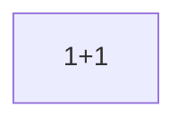

</details>

<details><summary><b>전화</b> — 1비트 · 선택점 1 (<code>arc_father_01_call</code>)</summary>

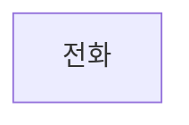

</details>

<details><summary><b>일요일 저녁</b> — 1비트 · 선택점 1 (<code>arc_father_quiet_call</code>)</summary>

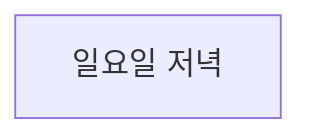

</details>

<details><summary><b>첫 면접</b> — 2비트 · 선택점 2 (<code>arc_intro_01_meal</code>)</summary>

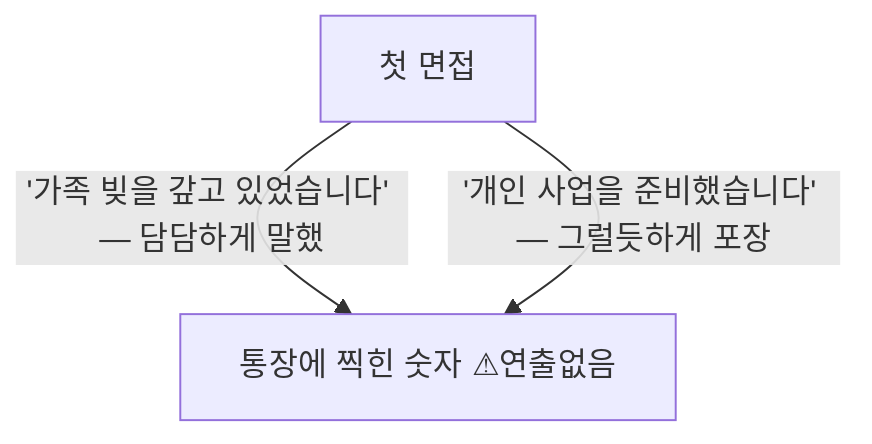

</details>

<details><summary><b>새벽 두 시</b> — 1비트 · 선택점 1 (<code>arc_intro_03_sns</code>)</summary>

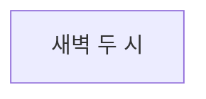

</details>

<details><summary><b>옆방</b> — 2비트 · 선택점 2 (<code>arc_intro_04_hyunsu</code>)</summary>

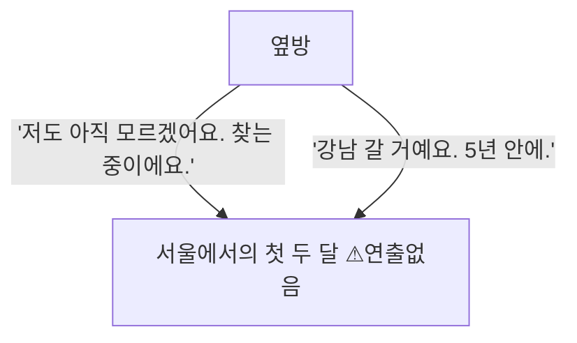

</details>

<details><summary><b>접촉</b> — 1비트 · 선택점 1 (<code>arc_jiyeon_01_crash</code>)</summary>

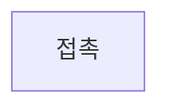

</details>

<details><summary><b>또, 너</b> — 1비트 · 선택점 1 (<code>arc_jiyeon_02_store</code>)</summary>

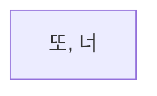

</details>

<details><summary><b>쉬운 돈</b> — 1비트 · 선택점 1 (<code>arc_temptation_01</code>)</summary>

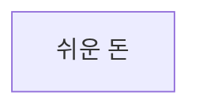

</details>

<details><summary><b>지나간 자리</b> — 1비트 · 선택점 0 (<code>arc_temptation_clean</code>)</summary>

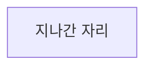

</details>

<details><summary><b>빌려준 계좌의 반환 요청</b> — 1비트 · 선택점 1 (<code>arc_temptation_fallout</code>)</summary>

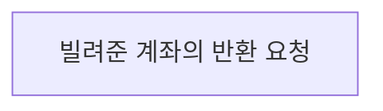

</details>

<details><summary><b>강남 카페</b> — 10비트 · 선택점 6 (<code>cafe_00</code>)</summary>

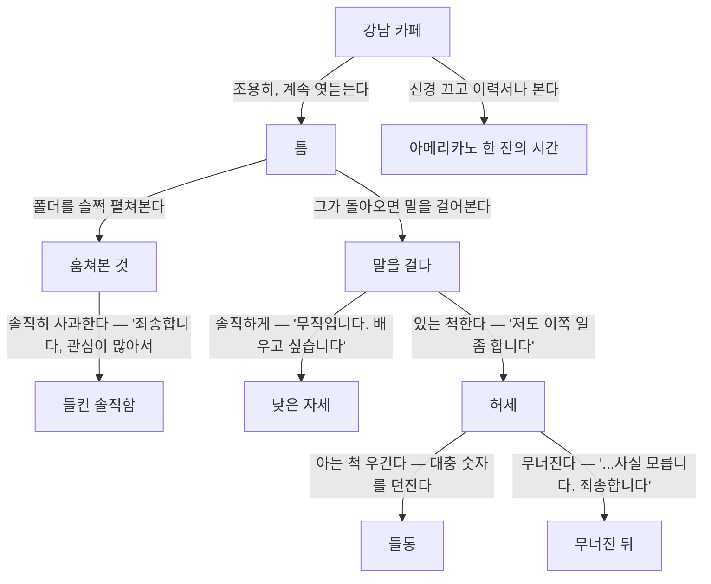

</details>

<details><summary><b>도시시설운영단 작업표 요청</b> — 1비트 · 선택점 0 (<code>v2_city_service_work_sample_message</code>)</summary>

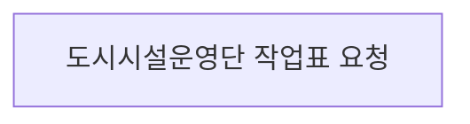

</details>

<details><summary><b>카운터의 첫 새벽</b> — 1비트 · 선택점 0 (<code>v2_convenience_trial_shift</code>)</summary>

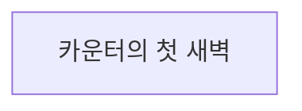

</details>

<details><summary><b>못 한 인사</b> — 1비트 · 선택점 1 (<code>v2_daeun_return_after_distance</code>)</summary>

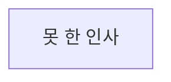

</details>

<details><summary><b>이번에는 먼저</b> — 1비트 · 선택점 1 (<code>v2_daeun_return_named</code>)</summary>

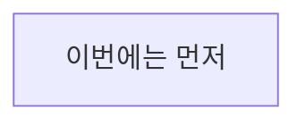

</details>

<details><summary><b>다음 화요일</b> — 1비트 · 선택점 1 (<code>v2_daeun_small_commitment</code>)</summary>

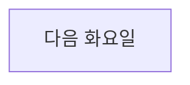

</details>

<details><summary><b>한마디 더</b> — 1비트 · 선택점 1 (<code>v2_daeun_third_greeting</code>)</summary>

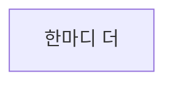

</details>

<details><summary><b>약속한 화요일</b> — 1비트 · 선택점 1 (<code>v2_daeun_tuesday_followthrough</code>)</summary>

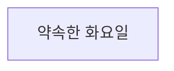

</details>

<details><summary><b>이번 주에 끝낼 한 가지</b> — 1비트 · 선택점 1 (<code>v2_demo_first_bill</code>)</summary>

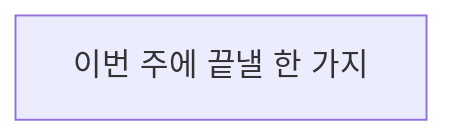

</details>

<details><summary><b>도담고객센터 채용 결과</b> — 1비트 · 선택점 0 (<code>v2_dodam_result_message</code>)</summary>

```mermaid
flowchart TD
  v2_dodam_result_message["도담고객센터 채용 결과"]
```

</details>

<details><summary><b>비워 둔 일요일</b> — 1비트 · 선택점 0 (<code>v2_empty_sunday</code>)</summary>

```mermaid
flowchart TD
  v2_empty_sunday["비워 둔 일요일"]
```

</details>

<details><summary><b>최씨 아저씨의 메시지</b> — 1비트 · 선택점 1 (<code>v2_father_health_signal</code>)</summary>

```mermaid
flowchart TD
  v2_father_health_signal["최씨 아저씨의 메시지"]
```

</details>

<details><summary><b>강남역 저녁 산책</b> — 1비트 · 선택점 1 (<code>v2_gangnam_receipt_walk</code>)</summary>

```mermaid
flowchart TD
  v2_gangnam_receipt_walk["강남역 저녁 산책"]
```

</details>

<details><summary><b>한빛유통 1차 면접</b> — 1비트 · 선택점 1 (<code>v2_hanbit_interview</code>)</summary>

```mermaid
flowchart TD
  v2_hanbit_interview["한빛유통 1차 면접"]
```

</details>

<details><summary><b>한빛유통 채용 연락</b> — 1비트 · 선택점 1 (<code>v2_hanbit_offer_message</code>)</summary>

```mermaid
flowchart TD
  v2_hanbit_offer_message["한빛유통 채용 연락"]
```

</details>

<details><summary><b>시험 전 마지막 문제</b> — 1비트 · 선택점 1 (<code>v2_hyunsu_exam_eve</code>)</summary>

```mermaid
flowchart TD
  v2_hyunsu_exam_eve["시험 전 마지막 문제"]
```

</details>

<details><summary><b>먼저 보낸 메시지</b> — 2비트 · 선택점 1 (<code>v2_hyunsu_player_reachout</code>)</summary>

```mermaid
flowchart TD
  v2_hyunsu_player_reachout["먼저 보낸 메시지"]
  v2_hyunsu_first_study["처음 함께한 한 시간"]
  v2_hyunsu_player_reachout -->|"내일 저녁으로 시간을 정한다"| v2_hyunsu_first_study
```

</details>

<details><summary><b>같은 시간</b> — 1비트 · 선택점 1 (<code>v2_hyunsu_study_followup</code>)</summary>

```mermaid
flowchart TD
  v2_hyunsu_study_followup["같은 시간"]
```

</details>

<details><summary><b>나흘째 바코드</b> — 1비트 · 선택점 0 (<code>v2_inventory_count_nights</code>)</summary>

```mermaid
flowchart TD
  v2_inventory_count_nights["나흘째 바코드"]
```

</details>

<details><summary><b>10년 만의 메시지</b> — 1비트 · 선택점 1 (<code>v2_jaehyuk_message</code>)</summary>

```mermaid
flowchart TD
  v2_jaehyuk_message["10년 만의 메시지"]
```

</details>

<details><summary><b>포장마차에서 다시</b> — 1비트 · 선택점 1 (<code>v2_jaehyuk_plain_reunion_echo</code>)</summary>

```mermaid
flowchart TD
  v2_jaehyuk_plain_reunion_echo["포장마차에서 다시"]
```

</details>

<details><summary><b>같은 동네 큰길</b> — 1비트 · 선택점 1 (<code>v2_jiyeon_second_crossing</code>)</summary>

```mermaid
flowchart TD
  v2_jiyeon_second_crossing["같은 동네 큰길"]
```

</details>

<details><summary><b>입출고표의 빈칸</b> — 1비트 · 선택점 0 (<code>v2_logistics_class_session</code>)</summary>

```mermaid
flowchart TD
  v2_logistics_class_session["입출고표의 빈칸"]
```

</details>

<details><summary><b>미래산업기술 채용 결과</b> — 1비트 · 선택점 0 (<code>v2_mirae_result_message</code>)</summary>

```mermaid
flowchart TD
  v2_mirae_result_message["미래산업기술 채용 결과"]
```

</details>

<details><summary><b>네 번째 집 앞</b> — 1비트 · 선택점 0 (<code>v2_moving_crew_days</code>)</summary>

```mermaid
flowchart TD
  v2_moving_crew_days["네 번째 집 앞"]
```

</details>

<details><summary><b>두 번째 믹스커피</b> — 1비트 · 선택점 1 (<code>v2_sangchul_demo_echo</code>)</summary>

```mermaid
flowchart TD
  v2_sangchul_demo_echo["두 번째 믹스커피"]
```

</details>

<details><summary><b>방 보러 간 날</b> — 4비트 · 선택점 2 (<code>v2_sangchul_housing_lead</code>)</summary>

```mermaid
flowchart TD
  v2_sangchul_housing_lead["방 보러 간 날"]
  arc_sangchul_01_measure["사람을 읽는 법"]
  arc_sangchul_01_coffee["종이컵 하나"]
  arc_sangchul_01_answer["그 질문"]
  v2_sangchul_housing_lead -->|"'제 사정을 어떻게 아셨어요?'"| arc_sangchul_01_measure
  v2_sangchul_housing_lead -->|"'커피만 마시고 가겠습니다.'"| arc_sangchul_01_coffee
  arc_sangchul_01_measure -->|"'그럼 저는 어디까지 갈 사람으로 보입니까?'"| arc_sangchul_01_answer
  arc_sangchul_01_coffee -->|"'그 질문에는 답할 수 있습니다.'"| arc_sangchul_01_answer
```

</details>

<details><summary><b>서린물산 채용 결과</b> — 1비트 · 선택점 0 (<code>v2_seorin_result_message</code>)</summary>

```mermaid
flowchart TD
  v2_seorin_result_message["서린물산 채용 결과"]
```

</details>

---

생성기: [`tools/project_dashboard.py`](../tools/project_dashboard.py) · 이 문서의 수치는 저장소의 현재 상태이며 손으로 적은 값이 아니다.
