# 강남드림 — 현재 상태

> **자동 생성 문서다. 손으로 고치지 않는다** — 다음 생성에서 지워진다.
> 값을 바꾸려면 이 파일이 아니라 원본(큐 표·정본 JSON·콘텐츠)을 고친다.
>
> 재생성: `python3 tools/project_dashboard.py --md docs/STATUS.md`
> 전 구간 선택 그래프를 대화형으로 보려면:
> `python3 tools/project_dashboard.py` → `build/project_dashboard.html`
>
> 생성 시각 · 커밋: `2026-08-20 08:15 UTC · 89d21823`

**개발용이다.** 아래는 `tint`·`route_*`와 정확한 수치를 그대로 적는다.
플레이어에게 노출하지 않는 값이므로 이 문서를 플레이어 대상 자료로 쓰지 않는다.

## 사람만 할 수 있는 판정

**초록불은 계약을 지켰다는 뜻이지 좋다는 뜻이 아니다.** 아래는 자동 검사가
대신할 수 없어 남아 있는 것이며, 원장은
[`human_gates.json`](human_gates.json)이 소유한다.

> **활성 demo_rc 주의:** 데모 제품 경계는 W1~24 CTA다. BUILD 2026.08.11.3은 clean 저장 복구 체크포인트로, macOS 패키지를 실제 사용자 autosave의 격리 복사본과 같은 playtest 저장 이름으로 부팅했고 원본 hash는 불변이다. Windows·macOS·Linux 산출물과 KO/EN 키보드·패드 24주 입력, 두 해상도 표면은 자동 검증했다. 같은 W1~24 demo_rc의 Month 2 진입, 정상 속도 재미·물리 패드·연속 A/V·원어민 게이트는 OPEN이다. W25~48 Chapter 1은 데모 RC나 사람 판정 조건이 아니다.

| 범위 | 판정 | 후보 | 표본·환경 | 합격 기준 | 소유 |
|---|---|---|---|---|---|
| activity_task_expansion · 3개월 나흘 야간 재고조사의 세 작업 대상, 보통 완료, 무리하기, 결과 장면과 다음 달 기억 | **재고조사 약속 수행 장면의 행동감**<br><sub>자동 검사는 조합·수치·저장·입력을 증명한다. 두 번의 선택이 실제 일을 처리한 감각인지, 웹 버튼 퀴즈인지 판단하지 못한다.</sub> | `demo_rc · ACTIVE 22f1f2ac / manifest 96e76edd` | inventory_task_first_play<br>같은 demo_rc에서 키보드 또는 패드로 재고조사 수행 장면을 처음부터 결과 장면까지 진행<br>보통 완료 한 번과 무리하기 한 번을 서로 다른 저장에서 비교 | 플레이어가 자신이 처리한 일, 남긴 일, 그 대가를 자기 말로 설명할 수 있음<br>선택이 숨은 정답 찾기나 웹 버튼 퀴즈가 아니라 실제 주간 약속을 수행하는 감각으로 읽힘<br>수행 화면과 결과 산문이 한 장면처럼 이어지며 다른 행동으로 확산할 근거가 생김 | `ORDER-92` |
| claim:controller · 공개 데모의 Steam Deck·DualSense·Switch Pro 지원 주장 | **물리 Steam Deck·DualSense·Switch Pro 실기기**<br><sub>InputMatrixCheck는 매핑과 글리프를 본다. 손에 쥐었을 때의 오작동은 실기기에서만 나온다.</sub> | `demo_rc · ACTIVE 22f1f2ac / manifest 96e76edd` | demo_physical_controller_matrix<br>Steam Deck·DualSense·Switch Pro를 각각 실제 장치에서 확인<br>배포 대상 플랫폼 패키지와 동일한 demo_rc 사용 | 각 장치에서 잘못 누름·포커스 소실·입력 지연 없이 데모 진행<br>Steam Deck에서 장면 전환 프레임 드롭과 셰이더 컴파일 끊김이 체험을 훼손하지 않음 | `USER-P0N` |
| claim:ja · 일본어 본문·엔딩·카탈로그를 출시 언어로 표시하는 주장 | **일본어 원어민 검수**<br><sub>커버리지 검사는 키 누락과 한글 누출을 잡는다. 자연스러움은 원어민만 안다.</sub> | `full_rc · REBUILD 대기` | ja_native_release_review<br>일본어 본문·엔딩·카탈로그와 대표 15장 캡처<br>게임 문맥을 아는 일본어 원어민 검수자 | 의미 반전·누락·한글 누출·번역투가 출시 표면에 없음<br>원어민이 자연스러운 일본어 출시본으로 GO | `ORDER-21` |
| claim:ja-demo, demo-release · 같은 demo_rc의 실제 24주 일본어 장면·선택·계획판·연락폰·오프닝·CTA | **일본어 24주 데모 원어민 문맥 검수**<br><sub>완전성 검사는 누락과 영어 우회를 잡는다. 한국어 정본의 인물 목소리·관계 거리·함축·돈의 체감·선택 인과가 자연스러운 일본어 장면으로 남았는지는 원어민의 직접 대조가 필요하다.</sub> | `demo_rc · ACTIVE 22f1f2ac / manifest 96e76edd` | ja_demo_native_context_review<br>게임 문맥과 한국어를 함께 이해하는 일본어 원어민 검수자<br>같은 demo_rc에서 ja_translation_audit.py --scope ui 및 --scope demo --strict PASS: legacy UI 2,782/2,782·context UI 30/30(총 UI 2,812/2,812)·73사건·471본문·657동적·4자산<br>같은 demo_rc를 새 세이브로 시작해 24주와 CTA까지 정상 속도로 독해<br>한 경로에 나오지 않은 합법 도달 73개 사건과 모든 선택·결과를 한국어 정본과 직접 대조 | 오역·누락·한글 누출·불필요한 영어 혼용·번역투가 없음<br>인물별 말투와 관계 거리, 대화의 함축과 여운, 원화 금액의 체감, 선택과 결과의 인과가 한국어 정본과 같은 장면으로 읽힘<br>원어민이 일본어 24주 데모 주장에 GO | `ORDER-81` |
| claim:zh-CN-demo, demo-release · 같은 demo_rc의 실제 24주 zh-CN 장면·선택·정적 UI·계획판·연락폰·오프닝·CTA | **중국어 간체 24주 데모 중국 본토 원어민 문맥 검수**<br><sub>엄격 검사는 누락·문자권·원화·글꼴을 잡지만 한국어 정본의 인물 목소리·관계 거리·함축·여운·한국 문화 설명량이 중국 본토의 자연스러운 장면으로 남았는지는 원어민의 직접 대조가 필요하다.</sub> | `demo_rc · ACTIVE 22f1f2ac / manifest 96e76edd` | zh_cn_demo_native_context_review<br>한국어와 게임 문맥을 함께 이해하는 중국 본토 원어민 검수자<br>해당 demo_rc에서 zh_translation_audit.py --lang zh-CN --strict PASS: legacy UI 2,782/2,782·context UI 30/30·73사건·471본문·657동적·4자산과 프로젝트 소유 SC 글꼴 준비 완료<br>같은 demo_rc를 새 세이브로 시작해 24주와 CTA까지 정상 속도로 독해<br>한 경로에 나오지 않은 합법 도달 73개 사건과 모든 선택·결과를 한국어 정본과 직접 대조<br>SC 글꼴이 JP 공유 한자보다 먼저 선택되는 실제 화면을 Windows·macOS·Linux/Steam Deck에서 확인 | 오역·누락·한글·가나·미번역 영어·지역 문자 혼용·번역투가 없음<br>인물별 말투와 관계 거리, 대화의 함축과 여운, 원화 금액의 체감과 모든 날짜·시각·기간·횟수·부호, 한국 문화 설명량, 선택과 결과의 인과가 한국어 정본과 같은 장면으로 읽힘<br>공식 근거 없는 인명 한자가 없고 실제 SC 자형·줄바꿈·안전영역이 자연스러움<br>중국 본토 원어민이 zh-CN 24주 데모 주장에 GO | `ORDER-82` |
| claim:zh-TW-demo, demo-release · 같은 demo_rc의 실제 24주 zh-TW 장면·선택·정적 UI·계획판·연락폰·오프닝·CTA | **중국어 번체 24주 데모 대만 원어민 문맥 검수**<br><sub>간체 검수나 문자 변환은 대만의 어휘·관계 말투·자형·문화 설명을 승인할 수 없다. 한국어 정본의 장면성과 돈의 체감을 보존했는지는 대만 원어민의 별도 직접 대조가 필요하다.</sub> | `demo_rc · ACTIVE 22f1f2ac / manifest 96e76edd` | zh_tw_demo_native_context_review<br>한국어와 게임 문맥을 함께 이해하는 대만 원어민 검수자<br>해당 demo_rc에서 zh_translation_audit.py --lang zh-TW --strict PASS: legacy UI 2,782/2,782·context UI 30/30·73사건·471본문·657동적·4자산과 프로젝트 소유 TC 글꼴 준비 완료<br>같은 demo_rc를 새 세이브로 시작해 24주와 CTA까지 정상 속도로 독해<br>한 경로에 나오지 않은 합법 도달 73개 사건과 모든 선택·결과를 한국어 정본과 직접 대조<br>TC 글꼴이 JP 공유 한자보다 먼저 선택되는 실제 화면을 Windows·macOS·Linux/Steam Deck에서 확인 | 오역·누락·한글·가나·미번역 영어·지역 문자 혼용·번역투가 없음<br>인물별 말투와 관계 거리, 대화의 함축과 여운, 원화 금액의 체감과 모든 날짜·시각·기간·횟수·부호, 한국 문화 설명량, 선택과 결과의 인과가 한국어 정본과 같은 장면으로 읽힘<br>공식 근거 없는 인명 한자가 없고 실제 TC 자형·줄바꿈·안전영역이 자연스러움<br>대만 원어민이 zh-TW 24주 데모 주장에 GO | `ORDER-82` |
| core_loop_v2_month1_expansion · 새 V2 저장 1개월차의 네 주간 여력 배치부터 W3 현수 세계 사건과 W4 첫 유혹·월말 수첩까지 | **첫 달 서울 사이클이 게임으로 읽히는가**<br><sub>자동 검사는 네 여력·네 노드, 진전·대가·기한, 저장과 인과 소유권을 증명한다. 배치할 때 실제로 망설이고 다음 주 결과를 자기 결정으로 느끼는지는 사용자 플레이만 판정한다.</sub> | `demo_rc · ACTIVE 22f1f2ac / manifest 96e76edd` | demo_month1_seoul_cycle_first_play<br>같은 demo_rc의 새 저장에서 튜토리얼만 보고 첫 달 서울 사이클을 시작<br>네 번의 배치와 임계 수행·세계 사건·월말 수첩을 정상 독해<br>유도 문구 없이 가장 고민한 배치, 얻은 것, 치른 대가, 놓친 기회, 현수 첫 만남의 소유자를 말함 | 플레이어가 여력 하나를 어느 노드에 왜 배치했는지와 그 대가를 기억함<br>현수를 미리 계획한 것이 아니라 세계 사건으로 만났다고 이해함<br>임계 장면과 놓친 특별 기회를 앞선 주간 배치 결과로 연결함<br>화면을 카드 채우기나 정답 고르기가 아니라 한정된 힘으로 한 달을 운영하는 게임으로 받아들임 | `ORDER-94` |
| demo · 3월 방 안의 장부와 4월 주거복지 상담, 1년·5년 뒤 기억 회수 | **3·4개월차 생활 장면과 장기 기억 판정**<br><sub>자동 검사는 일반 결과 카드가 사라지고 기억이 다시 읽히는지 증명한다. 장면이 실제 경험으로 남고 후대 회상이 같은 선택을 새 의미로 돌려주는지는 사람이 읽어야 안다.</sub> | `demo_rc · ACTIVE 22f1f2ac / manifest 96e76edd` | demo_user_deep_scene_review<br>같은 demo_rc에서 3월 장부 장면을 정상 속도로 읽고 두 선택을 각각 확인<br>같은 commit/tree의 읽기 전용 개발 체크포인트에서 3월의 첫 청구서·1년차·2장·5장 회수를 확인<br>같은 demo_rc에서 4월 주거복지 상담의 세 기준을 각각 확인하고, 같은 commit/tree의 읽기 전용 개발 체크포인트에서 첫 이사·1년차·마지막 주 회상을 확인 | 3월 장부가 수치 결과 카드가 아니라 한 번의 생활 경험으로 남고 두 선택 모두 민준에게 가능한 답으로 읽힘<br>4월에 고른 방의 기준이 후대 장면에서 문장을 반복하지 않고 잔액·혼자 있을 공간·시간의 다른 의미로 돌아옴<br>사용자 최종 GO | `ORDER-83` |
| demo · Core Loop V2의 1~24주 전체와 주 25 진입 전 기록 CTA | **데모 24주 전환·사람 GO**<br><sub>자동 게이트는 도달성과 계약을 본다. 24주가 하나의 이야기로 읽히는지는 사람 판정이 남는다.</sub> | `demo_rc · ACTIVE 22f1f2ac / manifest 96e76edd` | demo_user_normal_reading<br>demo_rc를 새 세이브로 시작해 24주와 CTA까지 정상 독해<br>중간 저장·복귀를 포함해 장면과 월간 전환을 기록 | 1~24주가 끊긴 기능 묶음이 아니라 하나의 이야기로 읽힘<br>24주 회고와 CTA가 갑작스러운 차단이 아니라 다음을 궁금하게 만드는 종결로 작동<br>사용자 최종 GO | `ORDER-57` |
| demo · Core Loop V2의 1~6개월 네 여력·직업/생계/사람/회복 노드·세계 시계·임계 수행·다음 달 영수증으로 이어지는 24주 전략 | **주간 루프가 재미있는가 — 망설임과 전략**<br><sub>루프 검사는 선택지 수와 도달성을 본다. 망설였는지는 사람만 안다.</sub> | `demo_rc · ACTIVE 22f1f2ac / manifest 96e76edd` | demo_user_normal_reading<br>demo_rc 24주 정상 독해 플레이<br>망설인 장면·선택 원문과 다르게 플레이할 의향을 기록<br>24주 직후 유도 없이 이 게임에서 반복해서 한 일과 가장 재미있었던 행동을 한 문장으로 설명 | 같은 주에 함께 할 수 없는 네 노드와 기한 사이에서 실제 고민이 생김<br>월별 노드와 사건이 바뀌어 24회의 배치가 같은 선택의 복제로 느껴지지 않음<br>플레이어가 게임의 핵심을 한정된 시간을 배치하고 포기한 것의 대가를 뒤에서 사는 생활 선택으로 설명하며, 대화 버튼만 고르는 게임으로 축소해 기억하지 않음<br>다르게 플레이하면 다른 5년이 될 것 같다는 사람 GO | `ORDER-26` |
| demo · KO/EN 데모 1~24주를 정상 독해 속도로 진행하는 체험 | **정상 속도 데모 24주 플레이**<br><sub>페이싱 검사는 사건 수와 간격을 센다. 지루한지는 세어지지 않는다.</sub> | `demo_rc · ACTIVE 22f1f2ac / manifest 96e76edd` | demo_normal_reading_full_run<br>같은 demo_rc에서 KO와 EN 각 1회<br>처음부터 24주 CTA까지 정상 독해 속도로 진행<br>언어 선택부터 24주 CTA까지 실제 경과 시간과 연속 확인 입력으로 넘긴 구간을 기록 | 반복 입력과 장면 간격을 포함한 24주 몰입에 사람 GO<br>75~95분 pre-playtest 목표를 실제 경과 시간으로 유지하거나 재조정하고, 목표 밖 결과를 자동 완주 추정치로 덮지 않음<br>자동 완주나 추정 플레이타임을 사람 판정으로 대신하지 않음 | `ORDER-22` |
| demo · KO/EN 데모 1~24주의 장면·폰·월간 계획·첫 청구서 연속 A/V | **데모 24주 연속 A/V 청취**<br><sub>계약 검사는 큐 존재와 파일 재생을 본다. 24주 동안 침묵·반복·음량 피로가 장면 흐름을 깨는지는 연속해서 들어야 안다.</sub> | `demo_rc · ACTIVE 22f1f2ac / manifest 96e76edd` | demo_av_human_review<br>같은 demo_rc의 KO/EN 24주 경로를 헤드폰·노트북 스피커·거실 TV에서 연속 청취<br>저장·복귀와 장면/폰/결산 전환을 포함 | 대사 가독성·장소 식별·음악 피로·효과음 반복에 사람 GO<br>무음·잘린 큐·장면 밖 잔류·갑작스러운 음량 변화가 24주 흐름을 깨지 않음 | `ORDER-57` |
| demo · 데모 시작 흐름·장면·폰·선택·결산·CTA의 표면 물성 | **화면이 싸구려 웹 모달이 아니라 이 게임의 물건으로 보이는가**<br><sub>surface_coherence는 분열의 흔적을 센다. 세지 못하는 것은 통일된 화면이 좋은가다.</sub> | `demo_rc · ACTIVE 22f1f2ac / manifest 96e76edd` | demo_surface_human_review<br>KO/EN demo_rc를 720p·800p·1080p에서 검토<br>마우스·패드 양쪽으로 실제 선택과 폰 표면을 조작 | 화면이 범용 웹 버튼 묶음이 아니라 강남드림의 같은 물건으로 보임<br>표면 전환 뒤 폰트·테마·포커스·재질이 다른 제품처럼 갈라지지 않음 | `ORDER-63` |
| demo · 데모 주연의 같은 감정군 표정·자세·시선 연기 | **표정 문법 — 같은 감정을 인물마다 다르게 연기하는가**<br><sub>자산 검사는 파일 유무를 본다. 연기의 차이는 나란히 놓고 봐야 안다.</sub> | `demo_rc · ACTIVE 22f1f2ac / manifest 96e76edd` | demo_cast_identity_review<br>같은 감정군의 주연 표정·자세·시선을 나란히 검토<br>실제 demo_rc 장면 크기에서 확인 | 같은 감정도 인물마다 고유한 표정·자세·시선 문법으로 읽힘 | `ORDER-64` |
| demo · 데모에 노출되는 주연 6인의 64 px 실루엣 | **64 px 실루엣 — 인물이 64픽셀에서 구분되는가**<br><sub>서명표는 소품과 모티프의 존재를 센다. 알아보는지는 눈으로 봐야 한다.</sub> | `demo_rc · ACTIVE 22f1f2ac / manifest 96e76edd` | demo_cast_identity_review<br>같은 크기·무채색 조건으로 주연 6인을 나란히 검토<br>실제 demo_rc 화면과 원본 자산을 함께 확인 | 이름·색·배경 없이도 여섯 인물을 서로 구분할 수 있음 | `ORDER-64` |
| demo · 데모에 노출되는 주연의 대표 장면과 고유 소품·욕망·모순 | **장면 소유 — 다른 인물로 대체 불가능한 장면을 갖는가**<br><sub>기계는 인물이 등장하는 장면 수를 센다. 대체 가능한지는 읽어야 안다.</sub> | `demo_rc · ACTIVE 22f1f2ac / manifest 96e76edd` | demo_cast_identity_review<br>주연별 대표 데모 장면을 이름을 가리고 교차 독해<br>대사·행동·소품을 다른 주연으로 바꿀 수 있는지 기록 | 각 주연이 다른 인물로 대체하면 무너지는 대표 장면을 하나 이상 가짐 | `ORDER-64` |
| demo · 무설명 30분 외부 정상 독해 — 24주 완주·위시리스트 판정과는 별도 | **외부 정상 독해 10인 플레이 (현재 0/10)**<br><sub>정합 검사는 모순을 잡지 재미를 잡지 않는다. 처음 읽는 사람만 아는 것이 있다.</sub> | `demo_rc · ACTIVE 22f1f2ac / manifest 96e76edd` | demo_external_readthrough_10<br>같은 revision과 manifest의 10명<br>EN 3명 이상<br>서사 게임 경험자·비경험자 각 4명 이상<br>개인정보 없는 무설명 30분 세션 | P0 기술 오류 세션 0<br>구체적인 다음 3주 계획 2점이 10명 중 7명 이상<br>playtest_report가 READY_FOR_HUMAN_VERDICT이고 원문을 사람이 검토해 GO | `ORDER-28` |
| demo · 새 V2의 프롤로그 지원부터 면접·125년 계산·아버지 부재중 전화·첫 계획까지 | **첫 계획 전 125년 장면이 동기를 만드는가**<br><sub>자동 검사는 숫자·순서·저장을 증명한다. 목표의 벽을 이해했는지, 정답을 강요받았는지, 장면이 하나처럼 이어졌는지는 사람에게 물어야 한다.</sub> | `demo_rc · ACTIVE 22f1f2ac / manifest 96e76edd` | demo_opening_first_five_minutes<br>같은 새 demo_rc를 처음 설치한 상태에서 설명 없이 첫 계획판까지 진행<br>선택 직후 유도 문구 없이 아래 세 질문에 답함 | 30억원이 평범한 월급 계획으로는 닿기 어렵다는 벽을 계획 전에 이해함<br>투자나 창업이 유일한 정답으로 제시됐다고 느끼지 않음<br>지원·면접·계산·아버지 연락이 따로 뜨는 카드가 아니라 한 흐름처럼 이어짐 | `ORDER-87` |
| demo · 아버지에게 한 응답 하나만 다른 두 24주 경로와 기존 21주 건강 신호·24주 첫 청구서의 후속 문구 | **아버지 응답의 작은 차이가 다음 장면에서 느껴지는가**<br><sub>자동 검사는 여섯 기억이 기존 장면의 정확한 문구 하나만 읽고 추가 카드나 점수를 만들지 않는다고 증명한다. 앞선 응답이 되돌아온 차이를 플레이어가 자연스럽게 알아차리는지는 사람이 정상 속도로 읽어야 한다.</sub> | `demo_rc · ACTIVE 22f1f2ac / manifest 96e76edd` | demo_father_memory_two_paths<br>같은 demo_rc의 두 저장이 아버지 장면에서 고른 응답 하나만 다르고 나머지 선택·상태·진행 속도는 같음<br>디버그 설명이나 문구 차이 안내 없이 각 경로를 해당 기존 후속 장면까지 정상 속도로 독해<br>후속 장면 직후 무엇이 달랐고 왜 달랐다고 느꼈는지 플레이어의 말로 기록 | 플레이어가 앞선 아버지 응답과 이어지는 구체적인 후속 문구 차이를 유도 없이 알아차림<br>기억 회수를 위해 새로 뜬 사건 카드나 결과 카드가 0개이고 기존 장면 안의 작은 완결로 느껴짐<br>숨은 관계 점수·능력치 보상·칭찬이나 비난·정답 선택으로 읽히는 요소가 0개임 | `ORDER-88` |
| demo · 프롤로그 정체성 선택과 24주 동안 반복된 민준의 동기 | **동기 문장을 플레이어가 실제로 기억하는가**<br><sub>각인 검사는 문장이 노출됐는지만 안다. 기억은 사람에게 물어야 한다.</sub> | `demo_rc · ACTIVE 22f1f2ac / manifest 96e76edd` | demo_user_normal_reading<br>demo_rc 24주 정상 독해 직후 유도 없이 질문<br>민준의 다음 일이 궁금한지와 플레이어가 고른 수첩 문장을 함께 기록 | 플레이어가 자신이 고른 수첩 문장을 기억함<br>민준에게 다음에 무슨 일이 생길지 궁금하다는 사람 판정 | `ORDER-23` |
| demo-release · P-10의 공통 영어 수단 1단위·주요 화자→청자 12단위·기능 화자와 단역 8단위·73사건/686동적 호출·657고유키 전수 교차 검토 1단위로 구성된 22단위 원장 | **24주 영어 목소리 임의 3단위 원어민 대조**<br><sub>구조·누출 검사는 문장이 존재하고 사실이 맞는지 확인한다. 이름을 가려도 화자와 관계 단계가 들리는지, 자연스러운 영어이면서 한국어의 거리와 함축을 보존하는지는 사람이 읽어야 판정할 수 있다.</sub> | `demo_rc · ACTIVE 22f1f2ac / manifest 96e76edd` | demo_en_voice_random_three<br>같은 demo_rc와 ORDER-86 전수 원장에서 사용자가 임의의 서로 다른 3단위를 고름<br>영어 원어민 또는 준원어민이 화자 이름을 가리고 관계 단계와 목소리의 차이를 설명<br>한국어 정본과 함께 의미·함축·관계 거리·숫자·날짜를 직접 대조<br>세 단위 중 하나라도 번역투·평탄화·과장된 호칭이면 표본만 고치지 않고 22단위를 전량 재검토 | 이름을 가려도 화자와 상대 관계가 문장 길이·직접성·머뭇거림·축약형·호칭으로 구별됨<br>자연스러운 영어이면서 한국어의 의미·함축·사실·관계 거리를 바꾸지 않음<br>데모에서 oppa와 -ssi는 0이고 hyung은 관계가 작동하는 자리에서만 선택적으로 쓰임<br>사용자 최종 GO | `ORDER-86` |
| demo-release · P-9의 정본 2단위·자동 검사 1단위·24주 원고 16단위·한영 대조 1단위로 구성된 20단위 전수 원장 | **24주 산문 임의 3단위 정상 독해**<br><sub>자동 검사는 도달 범위·시각·구조·플레이스홀더를 잠글 수 있지만, 설명형 꼬리가 실제로 사라졌는지와 이미지·행동의 여운이 자연스러운지는 사람이 정상 속도로 읽어야 판정할 수 있다.</sub> | `demo_rc · ACTIVE 22f1f2ac / manifest 96e76edd` | demo_user_prose_random_three<br>같은 demo_rc와 ORDER-85 전수 원장에서 사용자가 임의의 서로 다른 3단위를 고름<br>한국어 장면은 정상 속도로 읽고, 대응 영어는 같은 사실·행동·마지막 이미지를 말하는지 함께 확인<br>세 단위 중 하나라도 번역투·설명형 꼬리·사실 훼손이면 표본만 고치지 않고 20단위를 전량 재검토 | 장면이 방금 보여 준 감정이나 선택 의미를 마지막 문장으로 다시 해설하지 않음<br>날짜·금액·화자 지식·선택 결과가 바뀌지 않고 한국어와 영어가 같은 장면으로 읽힘<br>사용자 최종 GO | `ORDER-85` |
| full · 1~5장 대표 정점·연결·Quiet/Echo/Decision·활동·엔딩의 연속 A/V | **장별 헤드폰·노트북·TV 연속 청취**<br><sub>자동 검사는 파일 존재와 계약만 본다. 반복이 지겨운지, 따로 찾아들을 만한지는 들어야 안다.</sub> | `full_rc · REBUILD 대기` | full_av_human_review<br>각 장 대표 경로를 헤드폰·노트북 스피커·거실 TV에서 청취<br>USER-P0N 최종 A/V 판정과 같은 full_rc 사용 | 대사 가독성·장소 식별·음악 피로·효과음 반복·Moral 사람층 변화가 모두 GO<br>같은 장소 재시작과 장면 밖 잔류가 사람 청취에서 거슬리지 않음 | `ORDER-43` |
| order97-close, claim:ja-demo · Batch A의 StartMenu 16호출과 StoryMode 7호출, 총 23개 lookup-before-format 이동 표면 | **ORDER-97 Batch A 실제 UI 임의 3표면 대조**<br><sub>템플릿·인자·키 수 자동 검사는 lookup provenance를 증명하지만 시작·기록·설정·장면 화면의 최종 문맥과 값이 사람에게 맞게 읽히는지는 실제 후보 표면을 봐야 한다. 현재 소스가 active demo_rc 뒤로 전진했으므로 최신 후보 재발급과 사람 판정이 모두 필요하다.</sub> | `demo_rc · ACTIVE 22f1f2ac / manifest 96e76edd` | order97_batch_a_ui_format_random_three<br>현재 소스로 다시 발급한 같은 demo_rc와 ORDER-97 exact registry에서 사용자가 서로 다른 실제 표면 3개를 임의 선택<br>각 표면의 KO와 EN 최종 문자열이 migration 전 authored byte와 같은지 대조<br>일본어 사전 hit가 안정 템플릿과 대상 인자를 쓰며 영어 fallback이나 교차 언어 금액을 남기지 않는지 실제 화면에서 확인<br>같은 최종 demo_rc의 JA StartMenu·gallery·Story·i18n-layout에서 가나·한자·일본어 문장부호가 한 Noto Sans JP 굵기로 읽히고 줄바꿈·잘림이 없는지 확인<br>세 표면 중 하나라도 틀리면 표본만 고치지 않고 Batch A 23호출을 전량 재검토 | 세 실제 표면 모두 올바른 일본어 문맥·값·placeholder·줄바꿈으로 읽힘<br>JA 가나·한자·일본어 문장부호의 획 굵기와 정렬이 한 서체 역할로 보이고 잘림이 없음<br>KO/EN authored bytes와 숫자·날짜·금액 의미가 보존됨<br>사용자가 Batch A에 최종 GO | `ORDER-97` |
| order97-close, claim:ja-demo · Batch B의 GameState 4·MainGame 2·CommunicationPhone 3·ArubaGame 1·SeoulCycleBoard 2·CoreLoopPlanner 13, 총 25개 lookup-before-format 이동 표면 | **ORDER-97 Batch B 실제 UI 임의 3표면 대조**<br><sub>정적 원장은 남은 호출과 돈 formatter의 소유권을 증명하지만 계획판·연락폰·배달·재고조사 표면의 최종 문맥, 복수형, 고정 일정과 돈 단위는 같은 후보의 실제 화면에서 사람이 확인해야 한다. W1 지원서 완료 표면이 active demo_rc 뒤에 추가돼 최신 후보 재발급과 사람 판정이 모두 필요하다.</sub> | `demo_rc · ACTIVE 22f1f2ac / manifest 96e76edd` | order97_batch_b_ui_format_random_three<br>현재 소스로 다시 발급한 같은 demo_rc와 ORDER-97 exact registry에서 사용자가 서로 다른 실제 표면 3개를 임의 선택<br>각 표면의 KO와 EN 최종 문자열이 migration 전 authored byte와 같은지 대조<br>일본어 사전 hit와 영어 fallback의 인자 provenance, placeholder 결과, 고정 일정·복수형·원화 의미를 실제 화면에서 확인<br>같은 최종 demo_rc의 JA core-loop 계획판·서울 보드·연락폰·i18n-layout에서 가나·한자·일본어 문장부호가 한 Noto Sans JP 굵기로 읽히고 줄바꿈·잘림이 없는지 확인<br>세 표면 중 하나라도 틀리면 표본만 고치지 않고 Batch B 25호출을 전량 재검토 | 세 실제 표면 모두 올바른 일본어 문맥·값·placeholder·줄바꿈으로 읽힘<br>JA 가나·한자·일본어 문장부호의 획 굵기와 정렬이 한 서체 역할로 보이고 잘림이 없음<br>KO/EN authored bytes와 정확 원화의 숫자·부호·쉼표·단위 의미가 보존됨<br>사용자가 Batch B에 최종 GO | `ORDER-97` |
| order98-close, claim:controller · Batch A 15단위의 title/archive/save/completion/MainGame/Story 페이지·탭·화면 도구와 세 브랜드 글리프 | **ORDER-98 Batch A 의미 입력 임의 3표면 실기기 대조**<br><sub>자동 입력은 action·edge·상태 불변을 증명하지만, 처음 잡은 사람이 포커스 레일을 훑지 않고 L1/R1과 L2/R2의 역할을 바로 읽는지는 실제 손으로 판정해야 한다.</sub> | `demo_rc · ACTIVE 22f1f2ac / manifest 96e76edd` | order98_semantic_controller_batch_a_random_three<br>같은 active demo_rc와 ORDER-98 Batch A 15단위 원장에서 사용자가 서로 다른 실제 표면 3개를 임의 선택<br>실제 Steam Deck·DualSense·Switch Pro 중 해당 표면의 표시 글리프와 일치하는 패드로 정상 속도 수행<br>D-pad·ABXY·L1/R1·L2/R2 안내만 보고 코드·마우스·키보드 없이 핵심 행동을 첫 시도에 완료<br>한 표면이라도 잘못된 trigger 방향·숨은 확정·포커스 소실·12회 초과 왕복이면 표본만 고치지 않고 Batch A 15단위를 전량 재검토 | 세 표면 모두 L1/R1은 sibling group, L2/R2는 이전/다음 페이지 또는 감소/증가로 즉시 읽힘<br>확정·저장·불러오기·진행·종료가 trigger로 실행되거나 모달 뒤로 누수되는 경우 0<br>현재 장치 글리프·화면 동사·실제 입력이 일치하고 사용자 최종 GO | `ORDER-98` |
| order98-close, claim:controller · Batch B의 8 직접 게임, 큰 단위 값 조절, 중앙 진동 profile과 title/MainGame/Story 진동 설정 | **ORDER-98 Batch B 직접 게임·진동 임의 3표면 실기기 대조**<br><sub>자동화는 stake와 profile 호출을 셀 수 있지만, trigger 방향이 손에 자연스럽고 의미 진동은 구별되면서 30분 동안 피로하지 않은지는 실제 패드로만 판정할 수 있다.</sub> | `demo_rc · ACTIVE 22f1f2ac / manifest 96e76edd` | order98_semantic_controller_batch_b_random_three<br>같은 active demo_rc와 ORDER-98 Batch B 원장에서 사용자가 서로 다른 직접 게임 3개를 임의 선택<br>각 게임에서 L2 감소·R2 증가, 그룹 이동, 베팅·라운드·결과·재시작 또는 안전 종료를 실제 패드로 수행<br>같은 30분 구간에서 일반 포커스·탭·페이지·값 미리보기의 무진동과 의미 commit·위험·결과·물리 비트의 구분성을 확인<br>title/MainGame/Story에서 진동 OFF와 0%를 각각 켠 뒤 진행 중 cue 즉시 정지와 이후 무진동을 확인<br>한 게임이라도 오입력·잘못된 trigger 방향·disabled 상태 변화·일상 진동 피로·OFF 누출이 있으면 Batch B 15단위를 전량 재검토 | 세 게임 모두 L2 감소·R2 증가와 L1/R1 그룹 역할을 첫 시도에 구분함<br>일반 탐색은 조용하고 의미 profile은 화면·소리와 함께 서로 구별되며 30분 동안 거슬리지 않음<br>진동 OFF·0%에서 실제 출력 0이고 모든 정보·선택·결과가 그대로이며 사용자 최종 GO | `ORDER-98` |
| reference-system-implementation · REFERENCE_SYSTEM_VERDICTS.md의 44단위 전수 판정표와 그중 가져온다로 판정된 32단위 | **참조 시스템 판정표 채택 항목 임의 3단위 대조**<br><sub>자동 검사는 44단위 판정표의 구조와 기존 시스템 소유자를 확인할 수 있지만, 채택 항목이 강남드림 안에서 구체적으로 그려지고 서로를 지우지 않는지는 사람이 함께 읽어야 판정할 수 있다. active demo_rc는 발급됐지만 사람 판정 증거는 아직 없다.</sub> | `demo_rc · ACTIVE 22f1f2ac / manifest 96e76edd` | reference_system_verdicts_random_three<br>같은 demo_rc와 ORDER-95 전수 판정표에서 사용자가 가져온다 32단위 중 서로 다른 3단위를 임의 선택<br>각 단위가 강남드림에서 무엇이 되는지와 세 단위를 함께 적용해도 서로를 지우지 않는지 설명<br>세 단위 중 하나라도 구체적으로 그려지지 않거나 서로를 지우면 표본만 고치지 않고 44단위를 전량 재검토 | 세 채택 단위 모두 기존 강남드림 요소에 붙은 구체적인 변화로 읽히고 함께 놓아도 각자의 역할이 남음<br>사용자가 같은 demo_rc의 판정표 품질에 최종 GO<br>이 GO는 구현 승인이 아니며 실제 구현에는 별도 후속 오더와 사용자 승인이 필요함 | `ORDER-95` |

## 당신의 결정을 기다리는 것

에이전트가 작업 중 부딪혀 올린 제안이다. 규칙·상한은
[`PROPOSALS.md`](PROPOSALS.md)가 소유하며, 21일이 지나면 감사가 실패한다.

| | 제안 | 안 하면 계속 내는 것 | 권고 | 열림 |
|---|---|---|---|---|
| `P-18` | 프롤로그에 리듬이 없다 — 기술은 다 있는데 모든 비트가 같은 속도다 | 하면: (1)은 프롤로그 데이터 구조가 한 칸 늘고 KO/EN 두 해상도 | ****(1)만 먼저 한다.** 새 자산이 0이고 되돌리기 쉬우며, 실물을 보고** | 2026-08-11 |
| `P-17` | 열어 둘 것과 안 정해진 것을 가른다 — 본편이 딛고 선 사실 셋 | 하면: 세 사실을 확정해야 하고 ①②는 사용자 결정이 필요하다. | ****한다. 다만 답을 채우는 일이 아니라 경계를 긋는 일로 한다.**** | 2026-08-10 |

## 한눈에

| 지표 | 값 | 뜻 |
|---|---:|---|
| 사건 | 1,758 | KR 이벤트 전체 |
| 선택 2+ 사건 | 1,626 | 판정 대상 |
| 체인(장면) | 68 | 2링크 이상 |
| 연출 보유 사건 | 161 | 전체의 9% |
| 정답 선택 | 415 | 선택 2+ 사건의 25% |
| 테마 우회 | 2,116 | UIStyle 밖 override |
| 수동 스타일 | 260 | StyleBoxFlat 직접 생성 |
| 테마 리소스 | 0 | 늘어야 하는 지표 |
| 팔레트 밖 색 | 681 | 정본 12색 대비 |
| 진입점 없는 스크립트 | 2 | 래칫 |
| 서명 알려진 결함 | 5 | 악화만 실패 |
| 1링크·무연출 사건 | 69 | 독립 노출 재검토 |

## 오더

정본은 [`CODEX_QUEUE.md`](CODEX_QUEUE.md)의 활성 인덱스이고 여기는 그 사본이다.

| ID | 제목 | 상태 | 현재 게이트 |
|---|---|---|---|
| `ORDER-113` | 창업 | 진행 | 16/43 L1·L2 GO — L3 보류 |
| `ORDER-112` | career 세로줄 | 진행 | 16/43 L1·L2 GO — L3 보류 |
| `ORDER-111` | 마지막 해 대체 세로줄 | 진행 | 24/58 L1·L2 GO — L3 보류 |
| `ORDER-110` | 마지막 해 기준 세로줄 | 진행 | 20/51 L1·L2 GO — L3 보류 |
| `ORDER-109` | M34 반복·보고체·시계 도입 보정 | 진행 | 16 roots L1·L2 GO — L3 보류 |
| `ORDER-108` | M39~M48 실제 원고 | 진행 | 25/75 L1·L2 GO — L3 보류 |
| `ORDER-107` | M25~M36 후속 원고 | 진행 | 20/48 L1/L2 GO — L3 보류 |
| `ORDER-106` | M13~M24 실제 원고 | 진행 | 24/70 L1/L2 GO — L3 보류 |
| `ORDER-105` | M02~M12 실제 원고 | 진행 | 20 roots L1/L2 GO — L3 보류 |
| `ORDER-104` | 핵심 장면 원고 | 진행 | 23 roots L1/L2 — L3 보류 |
| `ORDER-103` | M01~M06 월간 약속을 직접 고르는 독립 체험판을 만든다 | 진행 | .2 L1/L2 — L3 보류 |
| `ORDER-99` | SAVE-P0 첫 달 4주차 진행 불능을 복구한다 | 진행 | BUILD .3 L1/L2 — 사용자 저장 확인 대기 |
| `ORDER-97` | LOC-0.5 전에 UI 템플릿을 번역 | 진행 | L1/L2 — 최신 후보·A/B 각 3표면 L3 대기 |
| `ORDER-98` | PAD-1 포커스 레일을 의미 버튼으로 줄인다 | 진행 | L1/L2 — 집 플레이·물리 패드 L3 대기 |

## 다섯 장 — 무엇을 열고 무엇을 닫는가

장마다 동사를 하나 열고 이전 동사를 하나 닫는다.
닫히는 쪽이 이 작품이 인접작과 갈라지는 지점이다.

### 1장 · 남은 사람 <sub>1–48주</sub>

> 정직하게 살아서는 닿을 수 없는 목표 앞에서 민준은 첫 선을 넘는가?

- **연다** — 시간을 판다 — 알바·지원·공부의 기본 동사 세트
- **닫는다** — (1장은 열기만 한다)
- **압력** — 이번 달 생존
- **실패** — 이번 달을 넘기지 못한다

### 2장 · 문을 여는 값 <sub>49–96주</sub>

> 기회가 사람의 얼굴로 올 때 민준은 호의와 거래를 구분할 수 있는가?

- **연다** — 사람이 기회를 가져온다 — 혼자서는 찾을 수 없는 기회가 소개로만 온다
- **닫는다** — 혼자 버는 것으로는 따라가지 못한다. 시간당 노동의 천장이 보인다
- **압력** — 관계 유지비 — 사람을 통해 오는 기회는 사람에게 쓸 시간을 요구한다
- **실패** — 유지비를 내지 못해 문이 열리지 않는다

### 3장 · 같은 손 <sub>97–144주</sub>

> 상처의 진실을 알게 된 민준은 가해자를 심판하는가, 이용하는가, 닮아 가는가?

- **연다** — 남의 돈을 움직인다 — 레버리지·보증·타인 자본
- **닫는다** — 시간 팔기가 무의미해진다. 알바 한 주가 기회비용 이하가 되어 1장의 생존 동사가 죽는다
- **압력** — 그 수단이 아버지를 무너뜨린 것과 같다는 걸 알고도 쓰는가
- **실패** — 남의 돈에 깔린다

### 4장 · 청구서 <sub>145–192주</sub>

> 사람과 몸이 성공의 비용으로 청구될 때 민준은 무엇을 먼저 지불하는가?

- **연다** — 규모를 고른다 — 되돌리기 어려운 크기의 판
- **닫는다** — 몸과 관계가 자원에서 제약으로 바뀐다. 소모하고 회복하던 것의 상한이 내려가고, 기다려 주던 사람이 더는 기다리지 않는다
- **압력** — 대신 내 줄 사람이 없다
- **실패** — 청구서를 몸이나 사람으로 낸다

### 5장 · 이름을 적는 사람 <sub>193–240주</sub>

> 마지막 숫자 앞에서 민준은 누구의 이름과 시간을 담보로 서명하는가?

- **연다** — 서명한다 — 되돌릴 수 없는 한 번의 결정
- **닫는다** — 대부분의 문이 이미 닫혀 있다. 새 기회가 오지 않고 남은 것으로만 한다
- **압력** — 지킬 것을 지킬 수 있는가
- **실패** — 다 얻고 아무도 남지 않는다

## 주연 여섯 — 서명

팬이 인물을 알아보는 근거는 렌더 품질이 아니라 같은 소품이 매번 그 자리에
있다는 사실이다. `언급`은 자산 정본이 그 소품을 실제로 말한 횟수이며,
**0이면 소품이 선언만 되고 지켜지지 않는다는 뜻이다.**

| 인물 | 욕망과 모순 | 소유 소품 | 오디오 모티프 | 언급 |
|---|---|---|---|---:|
| **Kim Daeun**<br>`daeun` | Has little to spare but notices what other people need | Handwritten post-it and the same hair clip in every outfit | Close felt piano and soft room tone, never cute chimes | 2 |
| **Father**<br>`father` | Shame makes him withdraw from the son he is trying to protect | 23-second call screen and debt records | Bare room tone with the four-note theme missing its last note | 0 |
| **Choi Jaehyuk**<br>`jaehyuk` | His kindness may be sincere and useful at the same time | Pocha photograph with a darkened second reading | Dry finger snap or shutter transient over Minjun's motif | 0 |
| **Han Jiyeon**<br>`jiyeon` | Offers the fastest path upward while refusing to be merely a guide | Unbranded black luxury-car key and angular earring | Cool piano interval with a held unresolved note | 7 |
| **Kim Minjun**<br>`minjun` | Wants a different life without knowing what may remain of him | Folded account statement showing the starting balance, never a luxury prop at launch | Four-note theme that can clear, distort, or hollow out | 0 |
| **Im Sangchul**<br>`sangchul` | The hand offering a ladder may be the hand that built the trap | Business card with handwritten number | Low brushed rhythm and one muted brass breath | 2 |

## 현재 구현 W1~24 audited prefix — 번들 60개

`행동`은 결과 카드이고 `장면`만 집필된 체인을 갖는다. `미집필`은 아직 없다.

| 번들 | 형태 | 종류 | 주차 | 인물 |
|---|---|---|---|---|
| `cafe_world_glimpse` | 장면 | temptation | 6–7 |  |
| `daeun_player_return` | 장면 | pursuit | 15–16 | daeun |
| `daeun_return_after_distance` | 장면 | pursuit | 15–16 | daeun |
| `daeun_shared_dream` | 장면 | pursuit | 20–20 | daeun |
| `daeun_third_greeting` | 장면 | pursuit | 19–20 | daeun |
| `daeun_world_meet` | 장면 | encounter | 10–12 | daeun |
| `demo_collision` | 장면 | boss | 24–24 | father |
| `father_first_call` | 장면 | care | 1–3 | father |
| `father_health_signal` | 장면 | care | 21–21 | father |
| `father_quiet_call` | 장면 | care | 9–12 | father |
| `first_temptation_boss` | 장면 | boss | 4–4 |  |
| `hyunsu_exam_eve` | 장면 | care | 23–23 | hyunsu |
| `hyunsu_first_meet` | 장면 | encounter | 1–3 | hyunsu |
| `hyunsu_player_reachout` | 장면 | pursuit | 5–6 | hyunsu |
| `hyunsu_study_followup` | 장면 | pursuit | 9–12 | hyunsu |
| `jaehyuk_plain_reunion_echo` | 장면 | pursuit | 19–20 | jaehyuk |
| `jaehyuk_world_meet` | 장면 | encounter | 13–16 | jaehyuk |
| `jiyeon_bus_stop_reunion` | 장면 | encounter | 15–16 | jiyeon |
| `jiyeon_second_crossing` | 장면 | pursuit | 19–20 | jiyeon |
| `jiyeon_world_meet` | 장면 | encounter | 10–12 | jiyeon |
| `m1_convenience_trial_shift` | 행동 | livelihood | 1–3 |  |
| `m1_mirae_application` | 행동 | career | 1–1 |  |
| `m1_phone_off_sunday` | 행동 | recovery | 1–3 |  |
| `m1_youth_center_resume_clinic` | 행동 | growth | 1–3 |  |
| `m2_mirae_result_message` | 장면 | consequence | 5–5 |  |
| `m2_rain_delivery_shift` | 행동 | livelihood | 6–7 |  |
| `m2_seorin_application` | 행동 | career | 5–6 |  |
| `m2_sleep_debt_sunday` | 행동 | recovery | 5–8 |  |
| `m2_youth_center_mock_interview` | 행동 | growth | 7–7 |  |
| `m3_empty_saturday` | 행동 | recovery | 9–11 |  |
| `m3_hanbit_application` | 행동 | career | 9–9 |  |
| `m3_inventory_shift` | 행동 | livelihood | 9–11 |  |
| `m3_library_job_board` | 행동 | growth | 9–12 |  |
| `m3_room_ledger` | 행동 | recovery | 9–12 |  |
| `m3_seorin_result_message` | 장면 | consequence | 9–9 |  |
| `m4_certificate_session` | 행동 | growth | 13–15 |  |
| `m4_dodam_application` | 행동 | career | 13–13 |  |
| `m4_hanbit_interview` | 장면 | career | 14–14 |  |
| `m4_health_check_day` | 행동 | recovery | 13–16 |  |
| `m4_housing_welfare_consultation` | 행동 | growth | 13–16 |  |
| `m4_logistics_shift` | 행동 | livelihood | 13–15 |  |
| `m5_city_service_application` | 행동 | career | 17–17 |  |
| `m5_employment_contract_clinic` | 행동 | growth | 17–20 |  |
| `m5_evening_spreadsheet_class` | 행동 | growth | 17–20 |  |
| `m5_hanbit_offer_message` | 장면 | consequence | 17–17 |  |
| `m5_last_empty_sunday` | 행동 | recovery | 17–20 |  |
| `m5_weekend_move_shift` | 행동 | livelihood | 17–20 |  |
| `m6_city_service_response` | 장면 | consequence | 23–23 |  |
| `m6_daeun_tuesday_followthrough` | 장면 | pursuit | 21–21 | daeun |
| `m6_dodam_response` | 장면 | consequence | 22–22 |  |
| `m6_gangnam_receipt_walk` | 장면 | reflection | 21–23 |  |
| `m6_holiday_night_shift` | 행동 | livelihood | 21–23 |  |
| `m6_last_study_group` | 행동 | growth | 21–23 |  |
| `m6_no_plans_day` | 행동 | recovery | 21–23 |  |
| `m6_public_recruitment` | 행동 | growth | 21–23 |  |
| `opening_interview_math` | 장면 | consequence | 1–4 |  |
| `sangchul_second_coffee` | 장면 | pursuit | 19–20 | sangchul |
| `sangchul_world_meet` | 장면 | encounter | 13–14 | sangchul |
| `sns_pressure_night` | 장면 | reflection | 5–8 |  |
| `temptation_consequence` | 장면 | consequence | 8–8 |  |

## 정답 선택 415건

한 선택이 [`DEMO_TIER_AUDIT.md`](DEMO_TIER_AUDIT.md)가 고정한 축 아홉에서
모두 우월하고, 최소 한 축에서 낫고, 후속도 플래그도 갈리지 않는 자리다.
**고민이 아니라 답이 있다.** 판정은 `tools/project_dashboard.py`의
`dominant_index()`가 소유한다.

| 파일 | 건수 |
|---|---:|
| `life_events.json` | 20 |
| `callback_events_25.json` | 13 |
| `investment_events.json` | 13 |
| `callback_events_14.json` | 12 |
| `callback_events_13.json` | 11 |
| `callback_events_16.json` | 11 |
| `callback_events_17.json` | 11 |
| `callback_events_21.json` | 11 |
| `drama_events2.json` | 11 |
| `callback_events_11.json` | 10 |
| `callback_events_19.json` | 10 |
| `callback_events_20.json` | 10 |
| `callback_events_22.json` | 10 |
| `callback_events_12.json` | 9 |
| `callback_events_23.json` | 9 |

상위 15개 파일만 적는다(전체 82개 파일).

## 선택 마인드맵 — 데모 체인 42개

체인 하나가 장면 하나다([`SCENE_TIER.md`](SCENE_TIER.md) §0).
지금 짓고 있는 데모 구간만 그린다 — 전 구간 65체인은 HTML 쪽에서 본다.
`⚠︎연출없음`은 `direction` 키가 없다는 뜻이고, 그 구현 링크는 아직 끝나지 않았다.

<details><summary><b>1+1</b> — 1링크 · 선택점 1 (<code>arc_daeun_01_meet</code>)</summary>

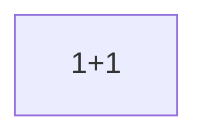

</details>

<details><summary><b>전화</b> — 1링크 · 선택점 1 (<code>arc_father_01_call</code>)</summary>

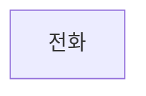

</details>

<details><summary><b>일요일 저녁</b> — 1링크 · 선택점 1 (<code>arc_father_quiet_call</code>)</summary>

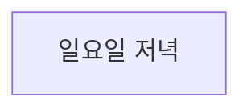

</details>

<details><summary><b>첫 면접</b> — 2링크 · 선택점 2 (<code>arc_intro_01_meal</code>)</summary>

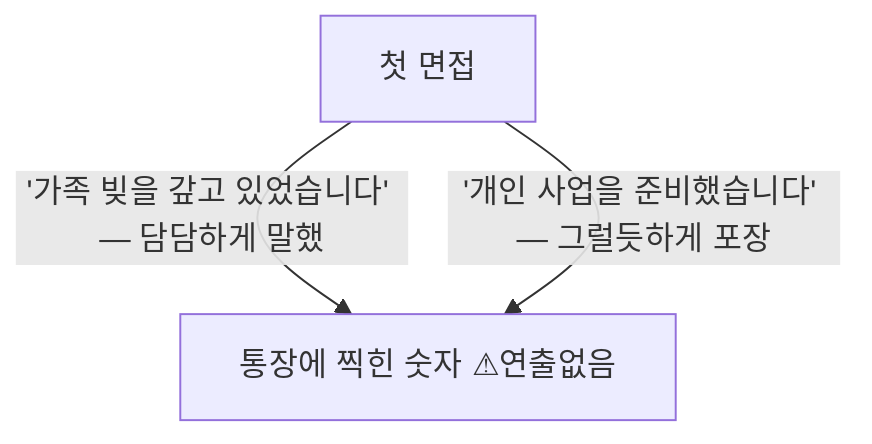

</details>

<details><summary><b>새벽 2시</b> — 1링크 · 선택점 1 (<code>arc_intro_03_sns</code>)</summary>

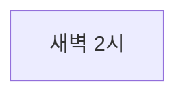

</details>

<details><summary><b>옆방</b> — 2링크 · 선택점 2 (<code>arc_intro_04_hyunsu</code>)</summary>

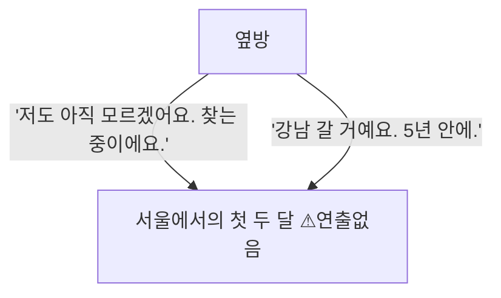

</details>

<details><summary><b>접촉</b> — 1링크 · 선택점 1 (<code>arc_jiyeon_01_crash</code>)</summary>

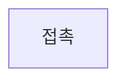

</details>

<details><summary><b>또, 너</b> — 1링크 · 선택점 1 (<code>arc_jiyeon_02_store</code>)</summary>

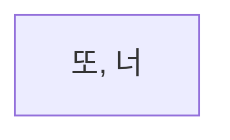

</details>

<details><summary><b>쉬운 돈</b> — 1링크 · 선택점 1 (<code>arc_temptation_01</code>)</summary>

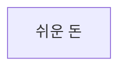

</details>

<details><summary><b>지나간 자리</b> — 1링크 · 선택점 0 (<code>arc_temptation_clean</code>)</summary>

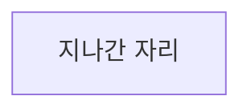

</details>

<details><summary><b>빌려준 계좌의 반환 요청</b> — 1링크 · 선택점 1 (<code>arc_temptation_fallout</code>)</summary>

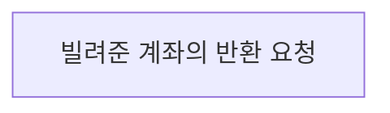

</details>

<details><summary><b>강남 카페</b> — 10링크 · 선택점 6 (<code>cafe_00</code>)</summary>

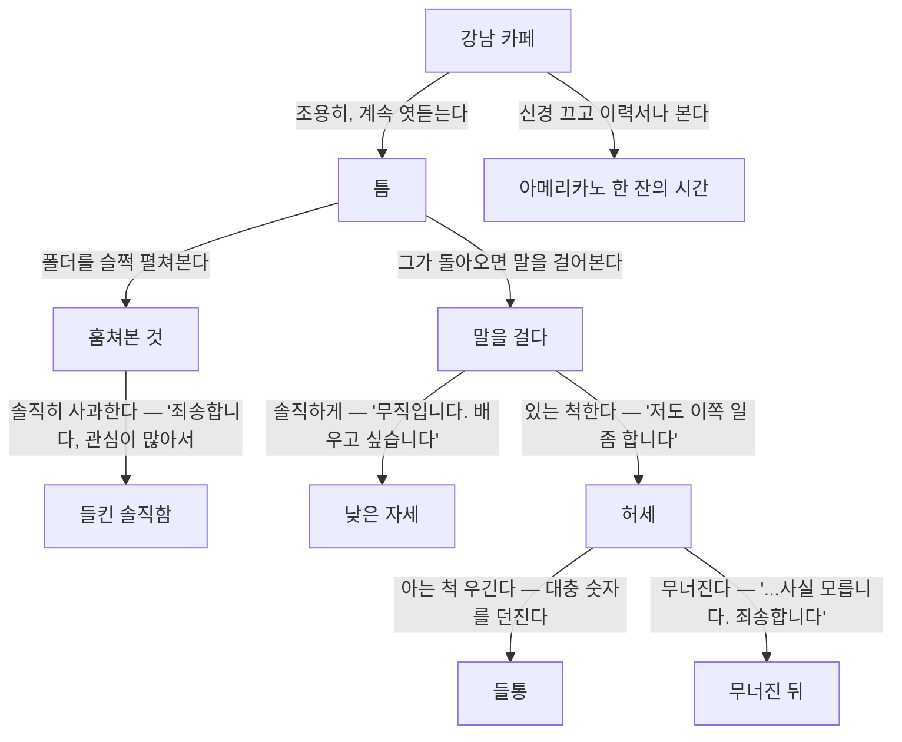

</details>

<details><summary><b>도시시설운영단 작업표 요청</b> — 1링크 · 선택점 0 (<code>v2_city_service_work_sample_message</code>)</summary>

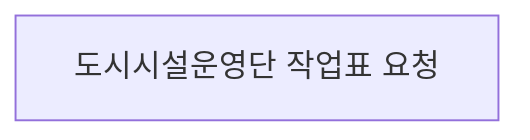

</details>

<details><summary><b>카운터의 첫 새벽</b> — 1링크 · 선택점 0 (<code>v2_convenience_trial_shift</code>)</summary>

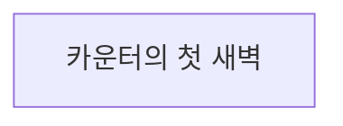

</details>

<details><summary><b>못 한 인사</b> — 1링크 · 선택점 1 (<code>v2_daeun_return_after_distance</code>)</summary>

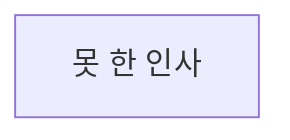

</details>

<details><summary><b>이번에는 먼저</b> — 1링크 · 선택점 1 (<code>v2_daeun_return_named</code>)</summary>

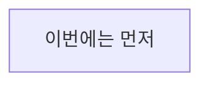

</details>

<details><summary><b>다음 화요일</b> — 1링크 · 선택점 1 (<code>v2_daeun_small_commitment</code>)</summary>

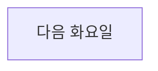

</details>

<details><summary><b>한마디 더</b> — 1링크 · 선택점 1 (<code>v2_daeun_third_greeting</code>)</summary>

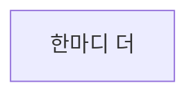

</details>

<details><summary><b>약속한 화요일</b> — 1링크 · 선택점 1 (<code>v2_daeun_tuesday_followthrough</code>)</summary>

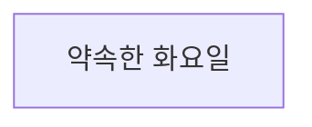

</details>

<details><summary><b>첫 청구서</b> — 3링크 · 선택점 2 (<code>v2_demo_first_bill_opening</code>)</summary>

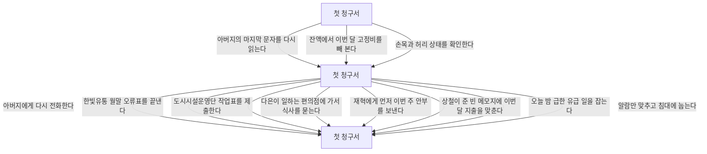

</details>

<details><summary><b>도담고객센터 채용 결과</b> — 1링크 · 선택점 0 (<code>v2_dodam_result_message</code>)</summary>

```mermaid
flowchart TD
  v2_dodam_result_message["도담고객센터 채용 결과"]
```

</details>

<details><summary><b>비워 둔 일요일</b> — 1링크 · 선택점 0 (<code>v2_empty_sunday</code>)</summary>

```mermaid
flowchart TD
  v2_empty_sunday["비워 둔 일요일"]
```

</details>

<details><summary><b>약국 봉투</b> — 1링크 · 선택점 1 (<code>v2_father_health_signal</code>)</summary>

```mermaid
flowchart TD
  v2_father_health_signal["약국 봉투"]
```

</details>

<details><summary><b>강남역 저녁 산책</b> — 1링크 · 선택점 1 (<code>v2_gangnam_receipt_walk</code>)</summary>

```mermaid
flowchart TD
  v2_gangnam_receipt_walk["강남역 저녁 산책"]
```

</details>

<details><summary><b>한빛유통 1차 면접</b> — 1링크 · 선택점 1 (<code>v2_hanbit_interview</code>)</summary>

```mermaid
flowchart TD
  v2_hanbit_interview["한빛유통 1차 면접"]
```

</details>

<details><summary><b>한빛유통 채용 연락</b> — 1링크 · 선택점 1 (<code>v2_hanbit_offer_message</code>)</summary>

```mermaid
flowchart TD
  v2_hanbit_offer_message["한빛유통 채용 연락"]
```

</details>

<details><summary><b>시험 전 마지막 문제</b> — 1링크 · 선택점 1 (<code>v2_hyunsu_exam_eve</code>)</summary>

```mermaid
flowchart TD
  v2_hyunsu_exam_eve["시험 전 마지막 문제"]
```

</details>

<details><summary><b>먼저 보낸 메시지</b> — 2링크 · 선택점 1 (<code>v2_hyunsu_player_reachout</code>)</summary>

```mermaid
flowchart TD
  v2_hyunsu_player_reachout["먼저 보낸 메시지"]
  v2_hyunsu_first_study["처음 함께한 한 시간"]
  v2_hyunsu_player_reachout -->|"내일 저녁으로 시간을 정한다"| v2_hyunsu_first_study
```

</details>

<details><summary><b>같은 시간</b> — 1링크 · 선택점 1 (<code>v2_hyunsu_study_followup</code>)</summary>

```mermaid
flowchart TD
  v2_hyunsu_study_followup["같은 시간"]
```

</details>

<details><summary><b>나흘째 바코드</b> — 1링크 · 선택점 0 (<code>v2_inventory_count_nights</code>)</summary>

```mermaid
flowchart TD
  v2_inventory_count_nights["나흘째 바코드"]
```

</details>

<details><summary><b>10년 만의 메시지</b> — 1링크 · 선택점 1 (<code>v2_jaehyuk_message</code>)</summary>

```mermaid
flowchart TD
  v2_jaehyuk_message["10년 만의 메시지"]
```

</details>

<details><summary><b>포장마차에서 다시</b> — 1링크 · 선택점 1 (<code>v2_jaehyuk_plain_reunion_echo</code>)</summary>

```mermaid
flowchart TD
  v2_jaehyuk_plain_reunion_echo["포장마차에서 다시"]
```

</details>

<details><summary><b>같은 동네 큰길</b> — 1링크 · 선택점 1 (<code>v2_jiyeon_second_crossing</code>)</summary>

```mermaid
flowchart TD
  v2_jiyeon_second_crossing["같은 동네 큰길"]
```

</details>

<details><summary><b>어긋난 한 줄</b> — 1링크 · 선택점 0 (<code>v2_logistics_class_session</code>)</summary>

```mermaid
flowchart TD
  v2_logistics_class_session["어긋난 한 줄"]
```

</details>

<details><summary><b>방 안의 장부</b> — 1링크 · 선택점 1 (<code>v2_m3_room_ledger_anchor</code>)</summary>

```mermaid
flowchart TD
  v2_m3_room_ledger_anchor["방 안의 장부"]
```

</details>

<details><summary><b>방을 고르는 기준</b> — 1링크 · 선택점 1 (<code>v2_m4_housing_consultation_anchor</code>)</summary>

```mermaid
flowchart TD
  v2_m4_housing_consultation_anchor["방을 고르는 기준"]
```

</details>

<details><summary><b>미래산업기술 채용 결과</b> — 1링크 · 선택점 0 (<code>v2_mirae_result_message</code>)</summary>

```mermaid
flowchart TD
  v2_mirae_result_message["미래산업기술 채용 결과"]
```

</details>

<details><summary><b>네 번째 집 앞</b> — 1링크 · 선택점 0 (<code>v2_moving_crew_days</code>)</summary>

```mermaid
flowchart TD
  v2_moving_crew_days["네 번째 집 앞"]
```

</details>

<details><summary><b>125년</b> — 1링크 · 선택점 1 (<code>v2_opening_return_math</code>)</summary>

```mermaid
flowchart TD
  v2_opening_return_math["125년"]
```

</details>

<details><summary><b>두 번째 믹스커피</b> — 1링크 · 선택점 1 (<code>v2_sangchul_demo_echo</code>)</summary>

```mermaid
flowchart TD
  v2_sangchul_demo_echo["두 번째 믹스커피"]
```

</details>

<details><summary><b>방 보러 간 날</b> — 4링크 · 선택점 2 (<code>v2_sangchul_housing_lead</code>)</summary>

```mermaid
flowchart TD
  v2_sangchul_housing_lead["방 보러 간 날"]
  arc_sangchul_01_measure["사람을 읽는 법"]
  arc_sangchul_01_coffee["종이컵 하나"]
  arc_sangchul_01_answer["그 질문"]
  v2_sangchul_housing_lead -->|"'제 사정을 어떻게 아셨어요?'"| arc_sangchul_01_measure
  v2_sangchul_housing_lead -->|"'커피만 마시고 가겠습니다.'"| arc_sangchul_01_coffee
  arc_sangchul_01_measure -->|"'그럼 저는 어디까지 갈 사람으로 보입니까?'"| arc_sangchul_01_answer
  arc_sangchul_01_coffee -->|"'그 질문에는 답할 수 있습니다.'"| arc_sangchul_01_answer
```

</details>

<details><summary><b>서린물산 채용 결과</b> — 1링크 · 선택점 0 (<code>v2_seorin_result_message</code>)</summary>

```mermaid
flowchart TD
  v2_seorin_result_message["서린물산 채용 결과"]
```

</details>

---

생성기: [`tools/project_dashboard.py`](../tools/project_dashboard.py) · 이 문서의 수치는 저장소의 현재 상태이며 손으로 적은 값이 아니다.
