# 강남드림 — 현재 상태

> **자동 생성 문서다. 손으로 고치지 않는다** — 다음 생성에서 지워진다.
> 값을 바꾸려면 이 파일이 아니라 원본(큐 표·정본 JSON·콘텐츠)을 고친다.
>
> 재생성: `python3 tools/project_dashboard.py --md docs/STATUS.md`
> 전 구간 선택 그래프를 대화형으로 보려면:
> `python3 tools/project_dashboard.py` → `build/project_dashboard.html`
>
> 생성 시각 · 커밋: `2026-08-03 04:25 UTC · e952e2f5`

**개발용이다.** 아래는 `tint`·`route_*`와 정확한 수치를 그대로 적는다.
플레이어에게 노출하지 않는 값이므로 이 문서를 플레이어 대상 자료로 쓰지 않는다.

## 사람만 할 수 있는 판정

**초록불은 계약을 지켰다는 뜻이지 좋다는 뜻이 아니다.** 아래는 자동 검사가
대신할 수 없어 남아 있는 것이며, 원장은
[`human_gates.json`](human_gates.json)이 소유한다.

| 판정 | 왜 사람이어야 하나 | 소유 |
|---|---|---|
| 장별 헤드폰·노트북·TV 연속 청취 | 자동 검사는 파일 존재와 계약만 본다. 반복이 지겨운지, 따로 찾아들을 만한지는 들어야 안다. | `ORDER-43` |
| 표정 문법 — 같은 감정을 인물마다 다르게 연기하는가 | 자산 검사는 파일 유무를 본다. 연기의 차이는 나란히 놓고 봐야 안다. | `ORDER-64` |
| 장면 소유 — 다른 인물로 대체 불가능한 장면을 갖는가 | 기계는 인물이 등장하는 장면 수를 센다. 대체 가능한지는 읽어야 안다. | `ORDER-64` |
| 64 px 실루엣 — 인물이 64픽셀에서 구분되는가 | 서명표는 소품과 모티프의 존재를 센다. 알아보는지는 눈으로 봐야 한다. | `ORDER-64` |
| 물리 Steam Deck·DualSense·Switch Pro 실기기 | InputMatrixCheck는 매핑과 글리프를 본다. 손에 쥐었을 때의 오작동은 실기기에서만 나온다. | `USER-P0N` |
| 일본어 원어민 검수 | 커버리지 검사는 키 누락과 한글 누출을 잡는다. 자연스러움은 원어민만 안다. | `ORDER-21` |
| 외부 정상 독해 10인 플레이 (현재 0/10) | 정합 검사는 모순을 잡지 재미를 잡지 않는다. 처음 읽는 사람만 아는 것이 있다. | `ORDER-28` |
| 동기 문장을 플레이어가 실제로 기억하는가 | 각인 검사는 문장이 노출됐는지만 안다. 기억은 사람에게 물어야 한다. | `ORDER-23` |
| 데모 24주 전환·사람 GO | 1~20주 자동 게이트는 통과했다. 24주가 하나의 이야기로 읽히는지는 판정이 남았다. | `ORDER-57` |
| 정상 속도 전체 플레이 | 페이싱 검사는 사건 수와 간격을 센다. 지루한지는 세어지지 않는다. | `ORDER-22` |
| 주간 루프가 재미있는가 — 망설임과 전략 | 루프 검사는 선택지 수와 도달성을 본다. 망설였는지는 사람만 안다. | `ORDER-26` |
| 화면이 싸구려 웹 모달이 아니라 이 게임의 물건으로 보이는가 | surface_coherence는 분열의 흔적을 센다. 세지 못하는 것은 통일된 화면이 좋은가다. | `ORDER-63` |

## 당신의 결정을 기다리는 것

에이전트가 작업 중 부딪혀 올린 제안이다. 규칙·상한은
[`PROPOSALS.md`](PROPOSALS.md)가 소유하며, 21일이 지나면 감사가 실패한다.

| | 제안 | 안 하면 계속 내는 것 | 권고 | 열림 |
|---|---|---|---|---|
| `P-1` | V2 생계·성장 루틴을 생활 리듬 +1로 조정한다 | V2 루틴 세 값과 설명, 정적·런타임 원장을 함께 고쳐야 한다. 적용 | ****한다.** 세 조합을 보존하면서 V2의 이중 스트레스만 상쇄하고,** | 2026-08-03 |
| `P-2` | 사람 테스트 전용 release flavor로 V2를 연다 | export preset·빌드 정체성·세이브 네임스페이스·진입 회귀 검사가 | ****한다.** 출시 기본값을 성급히 켜지 않으면서도 실제 배포물과 같은** | 2026-08-03 |
| `P-3` | 24주 첫 청구서를 ‘데모 전용 T1 정점’으로 등록한다 | KO/EN 후속 2장면, 전용 시각 자산 2종, 연출·오디오 계약과 | ****한다.** 48주 챕터 결말의 위상을 침범하지 않으면서 데모 자체의** | 2026-08-03 |

## 한눈에

| 지표 | 값 | 뜻 |
|---|---:|---|
| 사건 | 1,597 | KR 이벤트 전체 |
| 선택 2+ 사건 | 1,491 | 판정 대상 |
| 체인(장면) | 65 | 2비트 이상 |
| 연출 보유 사건 | 155 | 전체의 9% |
| 정답 선택 | 415 | 선택 2+ 사건의 27% |
| 테마 우회 | 2,116 | UIStyle 밖 override |
| 수동 스타일 | 260 | StyleBoxFlat 직접 생성 |
| 테마 리소스 | 0 | 늘어야 하는 지표 |
| 팔레트 밖 색 | 678 | 정본 12색 대비 |
| 진입점 없는 스크립트 | 2 | 래칫 |
| 서명 알려진 결함 | 5 | 악화만 실패 |
| 1비트·무연출 사건 | 45 | 밀도 하한 미달 |

## 오더

정본은 [`CODEX_QUEUE.md`](CODEX_QUEUE.md)의 활성 인덱스이고 여기는 그 사본이다.

| ID | 제목 | 상태 | 현재 게이트 |
|---|---|---|---|
| `ORDER-68` | 데모 출시 실행 순서 정합화 | 진행 | 착수 — 만지는 파일: 실행 큐·현재상태·인계·제안·사람 게이트·정합 검사. 게임 내용은 바꾸지 않는다 |
| `ORDER-57` | Core Loop V2 데모 재구축 | 진행 | D 1~20주 AUTO PASS. E 21~24주 후보 재통합 중 — 밀도·생계 authored·direction 백필과 조기 mental_break P1을 닫기 전 E PASS 금지. 전환·사람 GO OPEN |
| `ORDER-60` | 프롤로그부터 전면 재검토 | 진행 | 배치 1·2 완료(·), P0 0건. 3~7은 데모 출고 뒤 |
| `ORDER-62` | 기능 생존·킬링포인트 감사 | 미착수 | 기계 축 완료(Claude) — 고아 스크립트 래칫(feature_liveness_audit). 남은 것은 네 판정·킬링포인트 전수 판정, 제거는 사용자 승인 뒤 |
| `ORDER-61` | 정본 공백 (심의·접근성·저장·성능·오디오·리스크) | 미착수 | 미착수. 배치 1(등급·심의)이 P0 — 도박 4종 5,496줄에 GRAC·Steam 언급이 정본 0개. 등급은 사용자 결정. 나머지 다섯은 독립 |
| `ORDER-59` | 정합 기반 (지식 원장·다은 phase·규칙 화계) | 미착수 | 미착수. 대화량을 늘리기 전에 선행한다 — 화자도 지식도 표현할 자리가 없고 다은 phase가 typed fact가 아니다. 신규 장면에만 필수, 기존 1,581건은 래칫 |
| `ORDER-58` | 데모 평가 후속 | 미착수 | 미착수. 축 대칭·유혹 밀도·선택지 중립. ORDER-57 E 뒤, 영어 유혹 선택지 수리만 선행 가능. 구현보다 정본 배치를 먼저. 장르·스토어 약속은 사용자 결정 대기 |
| `ORDER-67` | `.gd` 분해 (한 파일이 전부인 상태) | 미착수 | 미착수. ORDER-57 E 뒤, ORDER-63 배치 3 앞. MainGame.gd 19,984줄=전체 21%, 함수 688·signal 0. 테마 override 645건(27%)이 여기 있어 배치 3을 막는다. 첫 칼은 미접촉 316함수 7,267줄 |
| `ORDER-63` | 표면 단일 언어 (UI·폰트·테마) | 미착수 | 배치 1·2 완료(Claude) — 계측기(surface_coherence_audit)·물성 정본(SURFACE_MATERIAL). 배치 3(테마 단일 출처)이 화면을 바꾼다. 데모 화면만 |
| `ORDER-64` | 서명·연속성 강제 | 미착수 | 배치 1·2 완료(Claude) — 서명표를 identity_signature.json으로 승격·배선. 알려진 결함 5건은 래칫. 배치 3~7(모티프·음색·채택률·연속성) 미착수 |
| `ORDER-65` | 장이 닫는 것을 실제로 닫는다 | 미착수 | 데모 출고 뒤. narrative_spine이 장마다 닫는 동사를 선언하는데 구현이 0 — 3장이 시간 팔기를 닫는다면서 JobSystem에 장 게이팅이 없다. 소비자 없는 정본 |
| `ORDER-66` | 제품 패키징 (크레딧·버전·고지) | 미착수 | 미착수. 빠진 것 셋 — 엔딩 크레딧·게임 버전 문자열·게임 내 제3자 고지. 폰트 OFL 사본과 빌드 포함은 선수리 완료. Steam SDK는 심의 뒤 별도 |
| `ORDER-43` | 실제 녹음/샘플 오디오 REWORK | 진행 | 장별 사람 연속 청취 |
| `USER-P0N` | 데모 장면 연출 문법 240주 전 구간 확산 | 진행 | 정상 속도·실기기·A/V 사람 판정 |
| `ORDER-21` | 일본어 번역 웨이브 | 진행 | 데모 GO 뒤 본문 번역·15장 캡처·원어민 검수 |
| `ORDER-23` | 동기 각인 수술 | 진행 | 동기 문장 기억 여부 사람 판정 |
| `ORDER-22` | 주간 루프 몰입 수리 | 진행 | 정상 속도 몰입·재미 사람 판정 |
| `ORDER-28` | 240주 전체 재구성 | 진행 | 외부 정상 독해 10인 플레이 0/10 |
| `ORDER-26` | AP 의미화 | 진행 | 망설임·전략 재미 사람 판정 |

## 다섯 장 — 무엇을 열고 무엇을 닫는가

장마다 동사를 하나 열고 이전 동사를 하나 닫는다.
닫히는 쪽이 이 작품이 인접작과 갈라지는 지점이다.

### 1장 · 남은 사람 <sub>1–48주</sub>

> 정직하게 살아서는 닿을 수 없는 목표 앞에서 민준은 첫 선을 넘는가?

- **연다** — 시간을 판다 — 알바·지원·공부의 기본 동사 세트
- **닫는다** — (1장은 열기만 한다)
- **압력** — 이번 달 생존
- **실패** — 이번 달을 넘기지 못한다

### 2장 · 문을 여는 값 <sub>49–96주</sub>

> 기회가 사람의 얼굴로 올 때 민준은 호의와 거래를 구분할 수 있는가?

- **연다** — 사람이 기회를 가져온다 — 혼자서는 찾을 수 없는 기회가 소개로만 온다
- **닫는다** — 혼자 버는 것으로는 따라가지 못한다. 시간당 노동의 천장이 보인다
- **압력** — 관계 유지비 — 사람을 통해 오는 기회는 사람에게 쓸 시간을 요구한다
- **실패** — 유지비를 내지 못해 문이 열리지 않는다

### 3장 · 같은 손 <sub>97–144주</sub>

> 상처의 진실을 알게 된 민준은 가해자를 심판하는가, 이용하는가, 닮아 가는가?

- **연다** — 남의 돈을 움직인다 — 레버리지·보증·타인 자본
- **닫는다** — 시간 팔기가 무의미해진다. 알바 한 주가 기회비용 이하가 되어 1장의 생존 동사가 죽는다
- **압력** — 그 수단이 아버지를 무너뜨린 것과 같다는 걸 알고도 쓰는가
- **실패** — 남의 돈에 깔린다

### 4장 · 청구서 <sub>145–192주</sub>

> 사람과 몸이 성공의 비용으로 청구될 때 민준은 무엇을 먼저 지불하는가?

- **연다** — 규모를 고른다 — 되돌리기 어려운 크기의 판
- **닫는다** — 몸과 관계가 자원에서 제약으로 바뀐다. 소모하고 회복하던 것의 상한이 내려가고, 기다려 주던 사람이 더는 기다리지 않는다
- **압력** — 대신 내 줄 사람이 없다
- **실패** — 청구서를 몸이나 사람으로 낸다

### 5장 · 이름을 적는 사람 <sub>193–240주</sub>

> 마지막 숫자 앞에서 민준은 누구의 이름과 시간을 담보로 서명하는가?

- **연다** — 서명한다 — 되돌릴 수 없는 한 번의 결정
- **닫는다** — 대부분의 문이 이미 닫혀 있다. 새 기회가 오지 않고 남은 것으로만 한다
- **압력** — 지킬 것을 지킬 수 있는가
- **실패** — 다 얻고 아무도 남지 않는다

## 주연 여섯 — 서명

팬이 인물을 알아보는 근거는 렌더 품질이 아니라 같은 소품이 매번 그 자리에
있다는 사실이다. `언급`은 자산 정본이 그 소품을 실제로 말한 횟수이며,
**0이면 소품이 선언만 되고 지켜지지 않는다는 뜻이다.**

| 인물 | 욕망과 모순 | 소유 소품 | 오디오 모티프 | 언급 |
|---|---|---|---|---:|
| **Kim Daeun**<br>`daeun` | Has little to spare but notices what other people need | Handwritten post-it and the same hair clip in every outfit | Close felt piano and soft room tone, never cute chimes | 2 |
| **Father**<br>`father` | Shame makes him withdraw from the son he is trying to protect | 23-second call screen and debt records | Bare room tone with the four-note theme missing its last note | 0 |
| **Choi Jaehyuk**<br>`jaehyuk` | His kindness may be sincere and useful at the same time | Pocha photograph with a darkened second reading | Dry finger snap or shutter transient over Minjun's motif | 0 |
| **Han Jiyeon**<br>`jiyeon` | Offers the fastest path upward while refusing to be merely a guide | Unbranded black luxury-car key and angular earring | Cool piano interval with a held unresolved note | 7 |
| **Kim Minjun**<br>`minjun` | Wants a different life without knowing what may remain of him | Folded account statement showing the starting balance, never a luxury prop at launch | Four-note theme that can clear, distort, or hollow out | 0 |
| **Im Sangchul**<br>`sangchul` | The hand offering a ladder may be the hand that built the trap | Business card with handwritten number | Low brushed rhythm and one muted brass breath | 2 |

## 데모 24주 — 번들 60개

`행동`은 결과 카드이고 `장면`만 집필된 체인을 갖는다. `미집필`은 아직 없다.

| 번들 | 형태 | 종류 | 주차 | 인물 |
|---|---|---|---|---|
| `cafe_world_glimpse` | 장면 | temptation | 6–7 |  |
| `daeun_player_return` | 장면 | pursuit | 15–16 | daeun |
| `daeun_return_after_distance` | 장면 | pursuit | 15–16 | daeun |
| `daeun_shared_dream` | 장면 | pursuit | 20–20 | daeun |
| `daeun_third_greeting` | 장면 | pursuit | 19–20 | daeun |
| `daeun_world_meet` | 장면 | encounter | 10–12 | daeun |
| `demo_collision` | 장면 | boss | 24–24 | father |
| `father_first_call` | 장면 | care | 1–3 | father |
| `father_health_signal` | 장면 | care | 21–21 | father |
| `father_quiet_call` | 장면 | care | 9–12 | father |
| `first_temptation_boss` | 장면 | boss | 4–4 |  |
| `hyunsu_exam_eve` | 장면 | care | 23–23 | hyunsu |
| `hyunsu_first_meet` | 장면 | encounter | 1–3 | hyunsu |
| `hyunsu_player_reachout` | 장면 | pursuit | 5–6 | hyunsu |
| `hyunsu_study_followup` | 장면 | pursuit | 9–12 | hyunsu |
| `jaehyuk_plain_reunion_echo` | 장면 | pursuit | 19–20 | jaehyuk |
| `jaehyuk_world_meet` | 장면 | encounter | 13–16 | jaehyuk |
| `jiyeon_bus_stop_reunion` | 장면 | encounter | 15–16 | jiyeon |
| `jiyeon_second_crossing` | 장면 | pursuit | 19–20 | jiyeon |
| `jiyeon_world_meet` | 장면 | encounter | 10–12 | jiyeon |
| `m1_convenience_trial_shift` | 행동 | livelihood | 1–3 |  |
| `m1_mirae_application` | 행동 | career | 1–1 |  |
| `m1_phone_off_sunday` | 행동 | recovery | 1–3 |  |
| `m1_youth_center_resume_clinic` | 행동 | growth | 1–3 |  |
| `m2_mirae_result_message` | 장면 | consequence | 5–5 |  |
| `m2_rain_delivery_shift` | 행동 | livelihood | 6–7 |  |
| `m2_seorin_application` | 행동 | career | 5–6 |  |
| `m2_sleep_debt_sunday` | 행동 | recovery | 5–8 |  |
| `m2_youth_center_mock_interview` | 행동 | growth | 7–7 |  |
| `m3_empty_saturday` | 행동 | recovery | 9–11 |  |
| `m3_hanbit_application` | 행동 | career | 9–9 |  |
| `m3_inventory_shift` | 행동 | livelihood | 9–11 |  |
| `m3_library_job_board` | 행동 | growth | 9–12 |  |
| `m3_room_ledger` | 행동 | recovery | 9–12 |  |
| `m3_seorin_result_message` | 장면 | consequence | 9–9 |  |
| `m4_certificate_session` | 행동 | growth | 13–15 |  |
| `m4_dodam_application` | 행동 | career | 13–13 |  |
| `m4_hanbit_interview` | 장면 | career | 14–14 |  |
| `m4_health_check_day` | 행동 | recovery | 13–16 |  |
| `m4_housing_welfare_consultation` | 행동 | growth | 13–16 |  |
| `m4_logistics_shift` | 행동 | livelihood | 13–15 |  |
| `m5_city_service_application` | 행동 | career | 17–17 |  |
| `m5_employment_contract_clinic` | 행동 | growth | 17–20 |  |
| `m5_evening_spreadsheet_class` | 행동 | growth | 17–20 |  |
| `m5_hanbit_offer_message` | 장면 | consequence | 17–17 |  |
| `m5_last_empty_sunday` | 행동 | recovery | 17–20 |  |
| `m5_weekend_move_shift` | 행동 | livelihood | 17–20 |  |
| `m6_city_service_response` | 장면 | consequence | 23–23 |  |
| `m6_daeun_tuesday_followthrough` | 장면 | pursuit | 21–21 | daeun |
| `m6_dodam_response` | 장면 | consequence | 22–22 |  |
| `m6_gangnam_receipt_walk` | 장면 | reflection | 21–23 |  |
| `m6_holiday_night_shift` | 행동 | livelihood | 21–23 |  |
| `m6_last_study_group` | 행동 | growth | 21–23 |  |
| `m6_no_plans_day` | 행동 | recovery | 21–23 |  |
| `m6_public_recruitment` | 행동 | growth | 21–23 |  |
| `opening_interview_math` | 장면 | consequence | 2–4 |  |
| `sangchul_second_coffee` | 장면 | pursuit | 19–20 | sangchul |
| `sangchul_world_meet` | 장면 | encounter | 13–14 | sangchul |
| `sns_pressure_night` | 장면 | reflection | 5–8 |  |
| `temptation_consequence` | 장면 | consequence | 8–8 |  |

## 정답 선택 415건

한 선택이 [`DEMO_TIER_AUDIT.md`](DEMO_TIER_AUDIT.md)가 고정한 축 아홉에서
모두 우월하고, 최소 한 축에서 낫고, 후속도 플래그도 갈리지 않는 자리다.
**고민이 아니라 답이 있다.** 판정은 `tools/project_dashboard.py`의
`dominant_index()`가 소유한다.

| 파일 | 건수 |
|---|---:|
| `life_events.json` | 20 |
| `callback_events_25.json` | 13 |
| `investment_events.json` | 13 |
| `callback_events_14.json` | 12 |
| `callback_events_13.json` | 11 |
| `callback_events_16.json` | 11 |
| `callback_events_17.json` | 11 |
| `callback_events_21.json` | 11 |
| `drama_events2.json` | 11 |
| `callback_events_11.json` | 10 |
| `callback_events_19.json` | 10 |
| `callback_events_20.json` | 10 |
| `callback_events_22.json` | 10 |
| `callback_events_12.json` | 9 |
| `callback_events_23.json` | 9 |

상위 15개 파일만 적는다(전체 82개 파일).

## 선택 마인드맵 — 데모 체인 39개

체인 하나가 장면 하나다([`SCENE_TIER.md`](SCENE_TIER.md) §0).
지금 짓고 있는 데모 구간만 그린다 — 전 구간 65체인은 HTML 쪽에서 본다.
`⚠︎연출없음`은 `direction` 키가 없다는 뜻이고, 그 비트는 아직 끝나지 않았다.

<details><summary><b>1+1</b> — 1비트 · 선택점 1 (<code>arc_daeun_01_meet</code>)</summary>

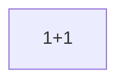

</details>

<details><summary><b>전화</b> — 1비트 · 선택점 1 (<code>arc_father_01_call</code>)</summary>


</details>

<details><summary><b>일요일 저녁</b> — 1비트 · 선택점 1 (<code>arc_father_quiet_call</code>)</summary>


</details>

<details><summary><b>첫 면접</b> — 2비트 · 선택점 2 (<code>arc_intro_01_meal</code>)</summary>

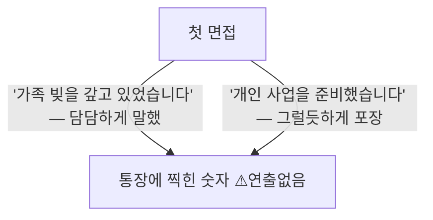

</details>

<details><summary><b>새벽 두 시</b> — 1비트 · 선택점 1 (<code>arc_intro_03_sns</code>)</summary>

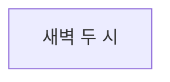

</details>

<details><summary><b>옆방</b> — 2비트 · 선택점 2 (<code>arc_intro_04_hyunsu</code>)</summary>

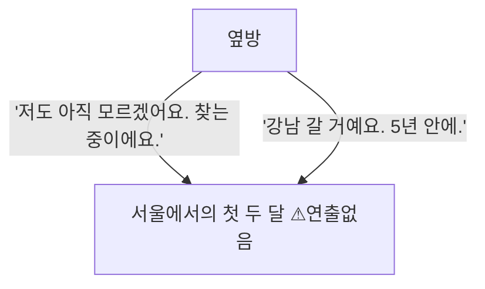

</details>

<details><summary><b>접촉</b> — 1비트 · 선택점 1 (<code>arc_jiyeon_01_crash</code>)</summary>

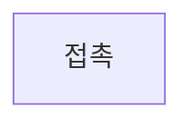

</details>

<details><summary><b>또, 너</b> — 1비트 · 선택점 1 (<code>arc_jiyeon_02_store</code>)</summary>

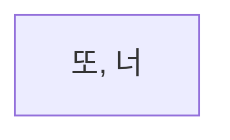

</details>

<details><summary><b>쉬운 돈</b> — 1비트 · 선택점 1 (<code>arc_temptation_01</code>)</summary>

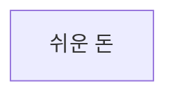

</details>

<details><summary><b>지나간 자리</b> — 1비트 · 선택점 0 (<code>arc_temptation_clean</code>)</summary>


</details>

<details><summary><b>빌려준 계좌의 반환 요청</b> — 1비트 · 선택점 1 (<code>arc_temptation_fallout</code>)</summary>

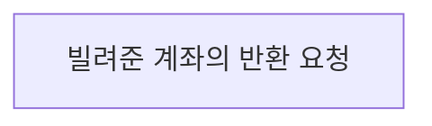

</details>

<details><summary><b>강남 카페</b> — 10비트 · 선택점 6 (<code>cafe_00</code>)</summary>

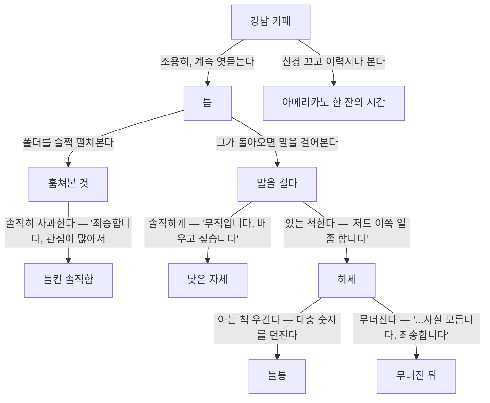

</details>

<details><summary><b>도시시설운영단 작업표 요청</b> — 1비트 · 선택점 0 (<code>v2_city_service_work_sample_message</code>)</summary>

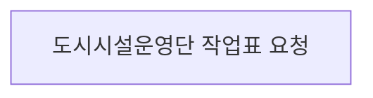

</details>

<details><summary><b>카운터의 첫 새벽</b> — 1비트 · 선택점 0 (<code>v2_convenience_trial_shift</code>)</summary>

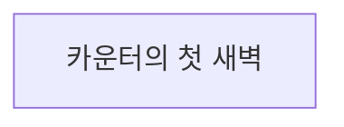

</details>

<details><summary><b>못 한 인사</b> — 1비트 · 선택점 1 (<code>v2_daeun_return_after_distance</code>)</summary>

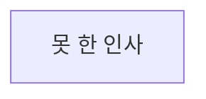

</details>

<details><summary><b>이번에는 먼저</b> — 1비트 · 선택점 1 (<code>v2_daeun_return_named</code>)</summary>


</details>

<details><summary><b>다음 화요일</b> — 1비트 · 선택점 1 (<code>v2_daeun_small_commitment</code>)</summary>

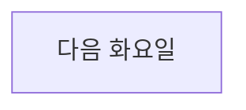

</details>

<details><summary><b>한마디 더</b> — 1비트 · 선택점 1 (<code>v2_daeun_third_greeting</code>)</summary>

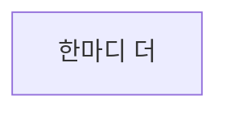

</details>

<details><summary><b>약속한 화요일</b> — 1비트 · 선택점 1 (<code>v2_daeun_tuesday_followthrough</code>)</summary>


</details>

<details><summary><b>이번 주에 끝낼 한 가지</b> — 1비트 · 선택점 1 (<code>v2_demo_first_bill</code>)</summary>

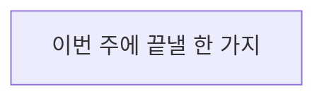

</details>

<details><summary><b>도담고객센터 채용 결과</b> — 1비트 · 선택점 0 (<code>v2_dodam_result_message</code>)</summary>

```mermaid
flowchart TD
  v2_dodam_result_message["도담고객센터 채용 결과"]
```

</details>

<details><summary><b>비워 둔 일요일</b> — 1비트 · 선택점 0 (<code>v2_empty_sunday</code>)</summary>

```mermaid
flowchart TD
  v2_empty_sunday["비워 둔 일요일"]
```

</details>

<details><summary><b>최씨 아저씨의 메시지</b> — 1비트 · 선택점 1 (<code>v2_father_health_signal</code>)</summary>

```mermaid
flowchart TD
  v2_father_health_signal["최씨 아저씨의 메시지"]
```

</details>

<details><summary><b>강남역 저녁 산책</b> — 1비트 · 선택점 1 (<code>v2_gangnam_receipt_walk</code>)</summary>

```mermaid
flowchart TD
  v2_gangnam_receipt_walk["강남역 저녁 산책"]
```

</details>

<details><summary><b>한빛유통 1차 면접</b> — 1비트 · 선택점 1 (<code>v2_hanbit_interview</code>)</summary>

```mermaid
flowchart TD
  v2_hanbit_interview["한빛유통 1차 면접"]
```

</details>

<details><summary><b>한빛유통 채용 연락</b> — 1비트 · 선택점 1 (<code>v2_hanbit_offer_message</code>)</summary>

```mermaid
flowchart TD
  v2_hanbit_offer_message["한빛유통 채용 연락"]
```

</details>

<details><summary><b>시험 전 마지막 문제</b> — 1비트 · 선택점 1 (<code>v2_hyunsu_exam_eve</code>)</summary>

```mermaid
flowchart TD
  v2_hyunsu_exam_eve["시험 전 마지막 문제"]
```

</details>

<details><summary><b>먼저 보낸 메시지</b> — 2비트 · 선택점 1 (<code>v2_hyunsu_player_reachout</code>)</summary>

```mermaid
flowchart TD
  v2_hyunsu_player_reachout["먼저 보낸 메시지"]
  v2_hyunsu_first_study["처음 함께한 한 시간"]
  v2_hyunsu_player_reachout -->|"내일 저녁으로 시간을 정한다"| v2_hyunsu_first_study
```

</details>

<details><summary><b>같은 시간</b> — 1비트 · 선택점 1 (<code>v2_hyunsu_study_followup</code>)</summary>

```mermaid
flowchart TD
  v2_hyunsu_study_followup["같은 시간"]
```

</details>

<details><summary><b>나흘째 바코드</b> — 1비트 · 선택점 0 (<code>v2_inventory_count_nights</code>)</summary>

```mermaid
flowchart TD
  v2_inventory_count_nights["나흘째 바코드"]
```

</details>

<details><summary><b>10년 만의 메시지</b> — 1비트 · 선택점 1 (<code>v2_jaehyuk_message</code>)</summary>

```mermaid
flowchart TD
  v2_jaehyuk_message["10년 만의 메시지"]
```

</details>

<details><summary><b>포장마차에서 다시</b> — 1비트 · 선택점 1 (<code>v2_jaehyuk_plain_reunion_echo</code>)</summary>

```mermaid
flowchart TD
  v2_jaehyuk_plain_reunion_echo["포장마차에서 다시"]
```

</details>

<details><summary><b>같은 동네 큰길</b> — 1비트 · 선택점 1 (<code>v2_jiyeon_second_crossing</code>)</summary>

```mermaid
flowchart TD
  v2_jiyeon_second_crossing["같은 동네 큰길"]
```

</details>

<details><summary><b>입출고표의 빈칸</b> — 1비트 · 선택점 0 (<code>v2_logistics_class_session</code>)</summary>

```mermaid
flowchart TD
  v2_logistics_class_session["입출고표의 빈칸"]
```

</details>

<details><summary><b>미래산업기술 채용 결과</b> — 1비트 · 선택점 0 (<code>v2_mirae_result_message</code>)</summary>

```mermaid
flowchart TD
  v2_mirae_result_message["미래산업기술 채용 결과"]
```

</details>

<details><summary><b>네 번째 집 앞</b> — 1비트 · 선택점 0 (<code>v2_moving_crew_days</code>)</summary>

```mermaid
flowchart TD
  v2_moving_crew_days["네 번째 집 앞"]
```

</details>

<details><summary><b>두 번째 믹스커피</b> — 1비트 · 선택점 1 (<code>v2_sangchul_demo_echo</code>)</summary>

```mermaid
flowchart TD
  v2_sangchul_demo_echo["두 번째 믹스커피"]
```

</details>

<details><summary><b>방 보러 간 날</b> — 4비트 · 선택점 2 (<code>v2_sangchul_housing_lead</code>)</summary>

```mermaid
flowchart TD
  v2_sangchul_housing_lead["방 보러 간 날"]
  arc_sangchul_01_measure["사람을 읽는 법"]
  arc_sangchul_01_coffee["종이컵 하나"]
  arc_sangchul_01_answer["그 질문"]
  v2_sangchul_housing_lead -->|"'제 사정을 어떻게 아셨어요?'"| arc_sangchul_01_measure
  v2_sangchul_housing_lead -->|"'커피만 마시고 가겠습니다.'"| arc_sangchul_01_coffee
  arc_sangchul_01_measure -->|"'그럼 저는 어디까지 갈 사람으로 보입니까?'"| arc_sangchul_01_answer
  arc_sangchul_01_coffee -->|"'그 질문에는 답할 수 있습니다.'"| arc_sangchul_01_answer
```

</details>

<details><summary><b>서린물산 채용 결과</b> — 1비트 · 선택점 0 (<code>v2_seorin_result_message</code>)</summary>

```mermaid
flowchart TD
  v2_seorin_result_message["서린물산 채용 결과"]
```

</details>

---

생성기: [`tools/project_dashboard.py`](../tools/project_dashboard.py) · 이 문서의 수치는 저장소의 현재 상태이며 손으로 적은 값이 아니다.
